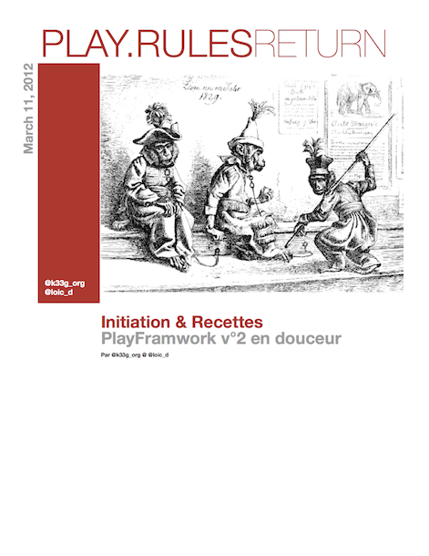

<h1>Les News chez <strong>Play.Rules!</strong><small>►</small></h1>

###Dimanche 11 mars
##Play.rules Return, on commence la version avec Play!► 2

Visible en mode web : [Play.Rules Return : Play!► 2 en douceur](http://3monkeys.github.com/play.rules/livre.play.deux.web/play.rules.return.html)

C'est en cours de rédaction, alors soyez patients ;)

##Play.rules, l'ebook : en mode web

[Play.Rules UN : apprendre Play!► version un](http://3monkeys.github.com/play.rules/livre.play.un.web/play.rules.one.html)

##Dimanche 4 mars

**L'ebook est là !!!** 

A télécharger ici : 

- pdf : [https://github.com/3monkeys/play.rules/raw/master/livre.play.un/play.rules.one.pdf](https://github.com/3monkeys/play.rules/raw/master/livre.play.un/play.rules.one.pdf)
- epub : [https://github.com/3monkeys/play.rules/raw/master/livre.play.un/play.rules.one.epub](https://github.com/3monkeys/play.rules/raw/master/livre.play.un/play.rules.one.epub)
- mobi (kindle) : [https://github.com/3monkeys/play.rules/raw/master/livre.play.un/play.rules.one.mobi](https://github.com/3monkeys/play.rules/raw/master/livre.play.un/play.rules.one.mobi)
- docx : [https://github.com/3monkeys/play.rules/raw/master/livre.play.un/play.rules.one.docx](https://github.com/3monkeys/play.rules/raw/master/livre.play.un/play.rules.one.docx)

C'est une 1ère version, mais l'ebook au format epub est disponible. Donc normalement, lisible sur iPad (je confirme), iPhone (mais un peu petit), etc. ...

Pour Android, le reader **Blio** permet d'avoir la colorisation du code source : [https://market.android.com/details?id=com.blio.androidreader&hl=en](https://market.android.com/details?id=com.blio.androidreader&hl=en)

Pour le Kindle, en cours de recherche de solution.

Pour lire le livre sur PC ou Mac vous pouvez utiliser le logiciel [Calibre](http://calibre-ebook.com/download)

Retours appréciés ;)

##Samedi 28 Janvier
Mise en ligne d'une présentation interactive du framework avec tutoriels intégrés : [voir ici](http://3monkeys.github.com/prez.play/)

##Lundi 28 novembre
Une première version [disponible en pdf](https://github.com/3monkeys/play.rules/blob/master/Play.Rules!►%20eBook.pdf?raw=true)

##Dimanche 27 novembre

- Ajout d'une fiche pratique sur la gestion des routes et des URL

##Samedi 26 novembre

- Ajout d'une fiche pratique sur la gestion du cache

##Samedi 22 octobre

- Ajout d'une nouvelle partie dediée au déploiement
- Et on commence avec Tomcat
- Contributions bienvenues ;)

##Vendredi 14 octobre

- amélioration du scrolling sous iOS5 (juste 1 ligne à changer!)

	la version "normale" du site est donc optimisée pour iPad (testée sur iPad 1 + iOS5)
	la version "mobile" devrait être pas mal sous iPhone (iOS5)
	la version "mobile" sous android s'en sort bien (testée sur HTC Desire)

##Lundi 10 octobre

- Une version pour mobile en ligne (beta à optimiser) : [http://3monkeys.github.com/play.rules/m.html](http://3monkeys.github.com/play.rules/m.html)

##Mercredi 5 octobre

Nous avons mis le temps, mais nous nous sommes enfin décidés à créer un mini-site lié au repository [https://github.com/3monkeys/play.rules](https://github.com/3monkeys/play.rules). Il vous permettra de naviguer dans les chapitres déjà écrits (il reste quelques réglages de mise en page pour le rendu, mais c'est déjà utilisable).

On vous le redit, si vous voulez participer, n'hésitez pas : [**"Fork us + pull requests"**](https://github.com/3monkeys/play.rules/fork). Vous pouvez aussi donner des idées (allez faire un tour dans les [issues](https://github.com/3monkeys/play.rules/issues)).

###A venir ... (1)

- Promis, on va vous faire une version pdf
- une version ePub ? Faut voir ... (nous allons creuser)
- une prez au Lyon Jug en novembre

Bien à vous ! [@loic_d](http://twitter.com/#!/loic_d) [@k33g_org](http://twitter.com/#!/k33g_org)

(1) *on a une famille, un travail, des enfants (surtout [@k33g_org](http://twitter.com/#!/k33g_org)), une vie sociale (surtout [@loic_d](http://twitter.com/#!/loic_d)) mais on va faire le maximum pour ajouter du contenu.*

##Nous utilisons :

- Zepto.js
- github.js
- showdown.js
- highlight.js
- nos mimines

##Pub!

- le blog de [@loic_d](http://twitter.com/#!/loic_d) : [http://coffeebean.loicdescotte.com/](http://coffeebean.loicdescotte.com/)
- le blog de [@k33g_org](http://twitter.com/#!/k33g_org) : [http://k33g.github.com/](http://k33g.github.com/)

**C'est plus sympa d'utiliser un navigateur de type "Webkit" pour visualiser le site, mais ça devrait le faire avec la dernière version de FF. Pour IE, je ne sais pas, je dois regarder ... Sur iPad+iOS5 ça doit être pas mal non plus :) @k33g_org**