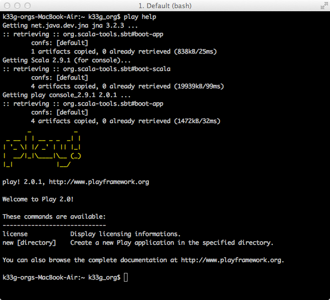

#Installation

**version de Play!► utilisée : 2.0.1**

	/* --- Qu'allons nous voir ? ---
		
		- Installation de Play2!►
			. sous OSX
			. sous Linux
			. sous Windows
	*/

##Prérequis

- Vous devez avoir Java sur votre machine : attention, vous devez avoir le JDK 6 minimum (Eh oui, vous avez le 7 aussi) : donc attention à ne pas proposer Play2!► à des clients étant encore en JDK 5 (si, ça existe encore !)
- Téléchargez Play!► sur [http://www.playframework.org/](http://www.playframework.org/)
- Dézippez l'archive dans un répertoire

Ensuite, il faut modifier votre path.

##Modification sous OSX

Dans une console (Terminal), tapez la commande suivante : 

	sudo pico ~/.bash_profile

Puis ajoutez la ligne suivante dans votre fichier de configuration : 

	export PATH=$PATH:/ENDROIT_OU_VOUS_AVEZ_DEZIPPE/play-2.0.1

Sauvegardez (sous pico, c'est `Ctrl+o`) et quittez l'éditeur, fermez votre Terminal.

où `ENDROIT_OU_VOUS_AVEZ_DEZIPPE` est le chemin vers Play!► et `play-2.0.1` le nom du répertoire dans lequel il y a les éléments constitutifs du framework (je laisse le numéro de version car il m'arrive de travailler sur plusieurs versions).

##Modification sous Linux

Dans une console (Terminal), tapez la commande suivante : 

	vi ~/.profile

Puis ajoutez les lignes suivantes à la fin de ce fichier : 

  export PLAY_HOME=/ENDROIT_OU_VOUS_AVEZ_DEZIPPE/play-2.0.1
	export PATH=$PLAY_HOME:$PATH

Sauvegardez et quittez l'éditeur (sous vi, c'est `ESCAPE`, `:`, `wq`), fermez votre console.

où `ENDROIT_OU_VOUS_AVEZ_DEZIPPE` est le chemin vers Play!► et `play-2.0.1` le nom du répertoire dans lequel il y a les éléments constitutifs du framework (je laisse le numéro de version car il m'arrive de travailler sur plusieurs versions).

##Modification sous Windows

Modifier les variables d'environnement de Windows, via `Panneau de configuration\Système et sécurité\Système`, puis `Paramètres systèmes avancés` sur la gauche. Dans la boîte de dialogue qui s'affiche, cliquer le bouton `Variables d'environnement...` en bas.

Ajouter une nouvelle `Variable système` :

*   Nom de la variable = PLAY_HOME
*   Valeur de la variable = ENDROIT_OU_VOUS_AVEZ_DEZIPPE\play-2.0.1

Puis modifier la valeur de la variable `Path` en ajoutant `%PLAY_HOME%;` au début (ne pas oublier le ';' !).

Cliquer sur tous les boutons `OK` pour fermer les différentes boîtes de dialogue.

##Vérification

Nous allons vérifier la bonne installation du framework. Ouvrez une nouvelle fois votre Console ou Terminal (il faut que cela soit une nouvelle session pour la prise en compte de la modification du path), et tapez la commande suivante :

	play help

Cela "mouline" un peu car Play2!► télécharge quelques dépendances. Vous devriez obtenir ceci :

Voilà c'est prêt, nous pouvons commencer.