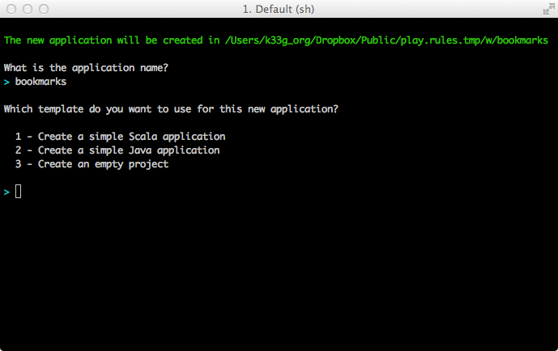
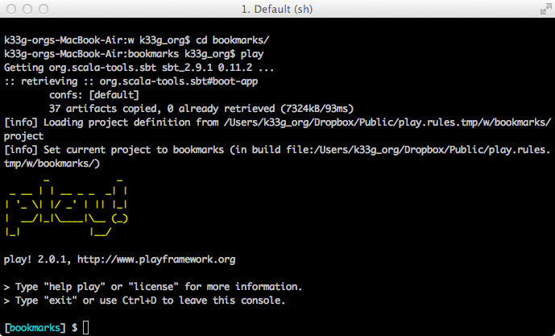
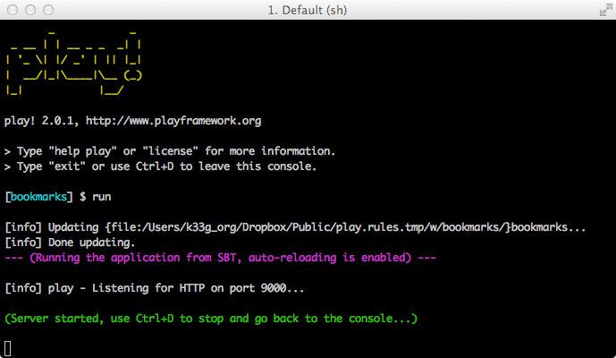
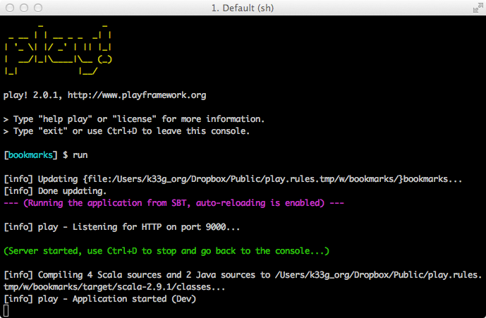

#1er contact

	/* --- Qu'allons nous voir ? ---
	
		- Comment générer le squelette de notre future application
		- Comment lancer l'application
		
		... jusque là, ça va ;)
	*/

##Génération du squelette de l'application

- Installez vous dans votre répertoire de travail (`cd mon_repertoire_de_travail`)
- Tapez la commande `play new bookmarks`
- validez et suivez les instructions

Play!► vous propose un nom par défaut pour votre application : acceptez

Play!► vous demande quel type de projet vous souhaitez générer, choisissez la version Java (deuxième choix donc) et validez :

C'est terminé :

Si vous aller jeter un coup d'oeil dans votre répertoire, vous pourrez vérifier que Play!► a généré toute l'arborescence applicative nécessaire :

Pour plus de détail sur l'anatomie d'une application Play!►, allez faire un tour par là : [http://www.playframework.org/documentation/2.0.1/Anatomy](http://www.playframework.org/documentation/2.0.1/Anatomy)

Lançons donc notre application pour être réellement sûr que nous avons tout ce qu'il faut. pour cela, tapez  les commandes :

	cd bookmarks
	play

La première fois, cela risque de prendre du temps, car Play!► télécharge divers éléments dont il a besoin pour fonctionner. Patientez un peu. Vous arrivez ensuite sur un "prompt" qui prend le nom de votre application `[bookmarks]` :

Tapez `run` et validez :

Vous pouvez lire que Play!► a démarré une application web sur laquelle vous pouvez vous connecter via [http://localhost:9000](http://localhost:9000). Allons-y.
En parallèle, côté serveur, ça compile :

Et au bout de quelques instants, si tout va bien, vous obtenez cette page dans votre navigateur :

