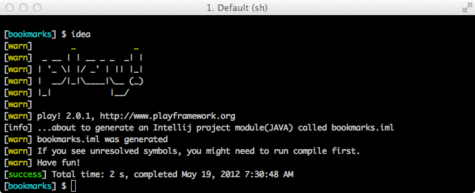
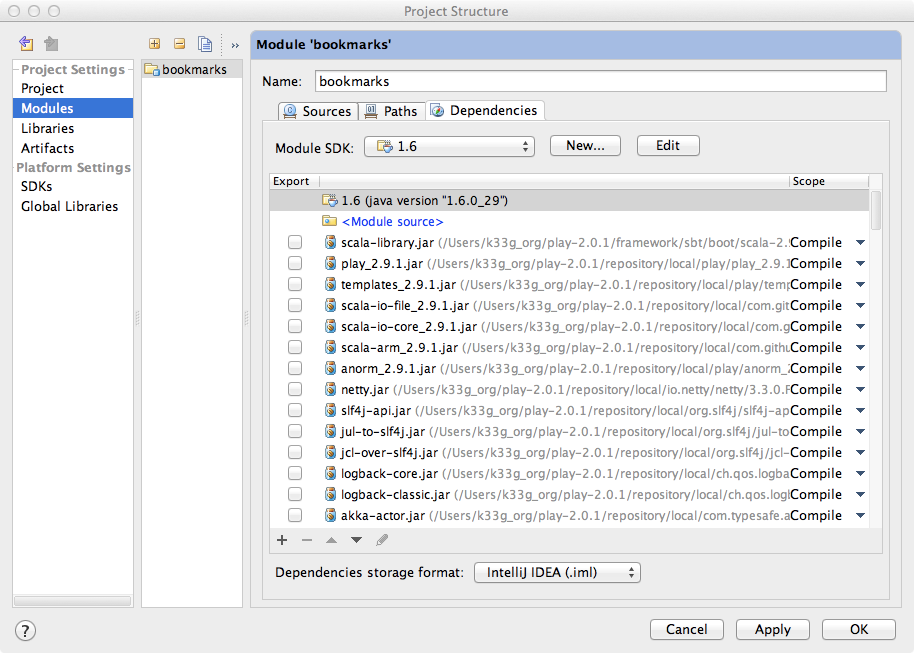

#Paramétrage de l'IDE

	/* --- Qu'allons nous voir ? ---

		- Comment paramétrer un IDE pour "bosser" facilement avec Play2!►
	
		Pour le moment je ne parle que d'IntelliJ. Sachez cependant qu'avec un peu d'habitude, il est possible de "faire du Play" avec un bon éditeur de texte comme SublimeText, UltraEdit, Notepad++, TextMate, ...
	*/

Nous avons donc une installation de Play2!► et un squelette d'application opérationnels. Avant d'aller plus loin, nous allons paramétrer un IDE pour nous faciliter le développement (il est aussi possible d'utiliser un simple éditeur de texte). Play!► peut fonctionner avec plusieurs IDE :

- IntelliJ
- NetBeans (il reste à ce jour encore quelques réglages/développements à réaliser)
- Eclipse

Je vous propose d'utiliser la version Community d'IntelliJ (qui semble faite pour Play!►), qui a l'avantage d'être gratuite et puissante à la fois. Pour les autres IDE, allez faire un tour sur le site de Play!►, tout est expliqué.

	//TODO : liens etc ...

##Paramétrage d'IntelliJ

Pour cela nous devons transformer notre arborescence projet en "module IDEA". Tout d'abord, arrêtez votre application : faites un `Ctrl+c`, puis relancez Play!► : `play` (vous êtes toujours dans le répertoire de votre application). Une fois que vous êtes revenu au prompt `[bookmarks]`, tapez la commande `idea` et validez. Vous obtenez ceci :

Play!► a généré dans le répertoire de l'application un fichier bookmarks.iml.

Passons au paramétrage du projet :

- Démarrez IntelliJ
- Créez un nouveau projet
- Choisir "Create project from scratch"
- Donnez un nom au projet (j'ai choisi de lui donner le même nom que mon application : bookmarks)
- Faite pointer "Project files location" sur le répertoire de votre application
- Décochez l'option "Create module"
- Cliquez sur "Finish"

IntelliJ va vous afficher une fenêtre "Project Structure" :

- Dans la rubrique "Modules" de "Projects Settings", ajoutez un module (utilisez l'icône "+")
- Sélectionnez le choix "import existing module"
- "Pointez" vers le fichier bookmarks.iml
- Cliquez sur "Finish"

Vous devriez obtenir l'écran suivant (si vous avez tout fait comme il faut) :

Cliquez sur "OK". Votre projet est prêt :

Nous sommes enfin prêts à commencer.

Si vraiment vous souhaitez utiliser un autre IDE, c'est expliqué ici : [https://github.com/playframework/Play20/wiki/IDE](https://github.com/playframework/Play20/wiki/IDE)
