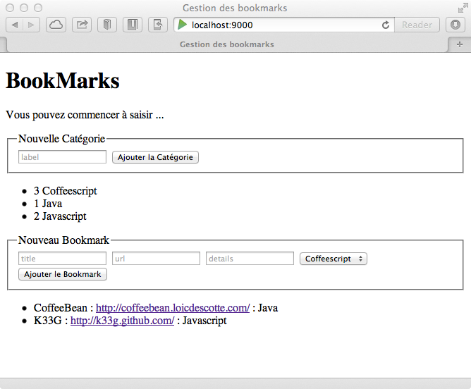

#On code !!!

	/* --- Qu'allons nous voir ? ---

		- Comment paramétrer notre application :
			. déclarer la base de données embarquée proposée par Play!►
			. créer nos premiers modèles
			. créer nos premiers contrôleurs, les modifier
			. paramétrer "les routes"
			. créer notre première vue
		
		... faites vous un bon café, et soyez attentif, cela devient sérieux.
		
	*/

##Très important !!!

Plutôt que d'utiliser la commande `run` vous pouvez utiliser `~run` et à ce moment là Play!► compile à la volée dès qu'il détecte un changement dans le code. Cela va accélérer grandement votre travail (merci à [@kraco_fr](@kraco_fr) pour ça, j'étais prêt à mettre Play!► en pause tellement la compilation était devenue lente et là c'est que du bonheur.)

##Construisons les bases de notre application : paramétrages

	//TODO : expliquer ce que va faire l'application

###Il nous faut une base de données

Tout d'abord, nous avons besoin d'une base de données. Nous allons aller au plus simple : Play!► "embarque" une base de donnée "H2 Database" ([http://www.h2database.com/html/main.html](http://www.h2database.com/html/main.html)) qui est une base de donnée rapide, légère, qui peut même fonctionner en mémoire et qui respecte les standards JDBC. Cela signifie que vous pouvez facilement prototyper vos applications avec cette base de données pour ensuite changer de base de manière transparente.

Pour définir notre base, allons faire un tour dans le fichier `conf/application.conf` et au niveau de la section `# Database configuration` ajoutons ceci :

	db.default.driver=org.h2.Driver
	db.default.url="jdbc:h2:file:play"

Nous avons donc expliqué à Play!►, que nous souhaitions utiliser la base de données "H2 Database" en mode fichier. Comme cela toutes nos modifications seront sauvegardées.

###Il nous faudra des modèles

Dans un premier temps :

- Créez un répertoire `models` dans `app` car cela n'est pas fait automatiquement (pour le moment ?) (dans IntelliJ, utilisez la fonction "New Package" sur le répertoire `app` et appelez le `models`)
- Dans conf/application.conf modifiez la partie `# Ebean configuration ` : Dé commentez la ligne : `ebean.default=models.*`

---
**Remarque :** Play!► 2 utilise **Ebean** comme framework de persistance au lieu de Hibernate+JPA (comme le faisait Play!► v°1). Ebean est un ORM Java qui continue à utiliser les annotations JPA (`@entity`, `@OneToMany`, ...) pour le mapping et qui propose une API plus simple (en tous les cas plus moderne) et qui a la particularité d'être *"sessionless"*.

	//TODO : expliquer sessionless

---

##Les modèles

Nous allons étudier ça par l'exemple.

###Création d'un 1er modèle : Category

Créez une classe `Category.java` dans `app/models` : 

```java

	package models;

	import play.db.ebean.Model;
	import javax.persistence.*;

	@Entity
	public class Category extends Model{

	    @Id
	    public Long id;
	    public String label;

	    public static Finder<Long, Category> find = 
	            new Finder<Long, Category>(Long.class, Category.class);

	}
```

---
Nous avons eu besoin d'importer `play.db.ebean.Model` pour pouvoir persister nos modèles, `javax.persistence.*` pour pouvoir utiliser les annotations. Nous avons fait précéder notre classe de l'annotation `@Entity` et hériter de `Model` pour pouvoir bénéficier des fonctionnalités de persistance. Et l'utilisation de l'annotation `@Id` nous permet de définir que la clé du modèle en base de données est `id`. Notez le membre `find` de type `Finder`, `Finder` est un type "apporté" per Ebean, il nous permettra d'interroger nos modèles.

---

Redémarrez dès maintenant l'application et connectez vous à [http://localhost:9000/](http://localhost:9000/) avec votre ordinateur.

Play!► détecte (c'est un peu long, je vous l'accorde) que vous avez créé un modèle et vous propose donc de créer le modèle de données (la table category dans notre cas) :


Cliquez sur **"Apply this script now !"** pour créer la structure de données dans la base. ... Et votre base de données est ainsi créée.

###Création d'un 2ème modèle : Bookmark

De la même manière, créez un modèle Bookmark :

```java

	package models;

	import play.db.ebean.Model;
	import javax.persistence.*;

	@Entity
	public class Bookmark extends Model {

	    @Id
	    public Long id;
	    public String title;
	    public String url;
	    public String details;

	    @ManyToOne
	    public Category category;

	    public static Finder<Long, Bookmark> find = 
	            new Finder<Long, Bookmark>(Long.class, Bookmark.class);
	}
```

---
**Remarques :**

- Notez l'annotation `@ManyToOne` : nous expliquons à Play!► qu'un `Bookmark` peut appartenir à plusieurs `Category(ies)`.

---

Vous venez de créer un nouveau modèle, il est temps de "rafraîchir" à nouveau votre application. Play!► détecte la modification et vous propose encore une fois d'appliquer le script pour modifier la base de données. Acceptez :


A ce stade, nous avons nos modèles et une base de données. mettons en oeuvre la suite de notre mécanique pour pouvoir bientôt jouer justement avec ces modèles.

##Les contrôleurs

Par convention, nous nommons un contrôleur d'un modèle avec le nom du modèle au pluriel, par exemple : `Bookmarks` pour le contrôleur du modèle `Bookmark` (en même temps, si vous avez envie de le nommer `BookmarksController`, rien ne vous en empêche).

###Création du contrôleur Bookmarks

Dans `/app/controllers/` créez la classe `Bookmarks.java` :

```java

	package controllers;

	import models.Bookmark;

	import play.data.Form;
	import play.mvc.Controller;
	import play.mvc.Result;

	public class Bookmarks extends Controller {

	    public static Result add() {

	        final Form<Bookmark> bookmarkForm = form(Bookmark.class).bindFromRequest();
	        final Bookmark bookmark = bookmarkForm.get();

	        bookmark.save();
	        return redirect(routes.Application.index());

	    }
	}
```

####Qu'avons nous fait ?

- Nous avons un contrôleur `Bookmarks` avec une méthode `add()`
- `final Form<Bookmark> bookmarkForm = form(Bookmark.class).bindFromRequest()` permet de récupérer les informations en provenance d'un `POST` à partir d'un formulaire html (`<form></form>`)
- `final Bookmark bookmark = bookmarkForm.get()` permet de créer une instance de `Bookmark` avec les informations en provenance du formulaire
- `bookmark.save()` permet d'ajouter le bookmark en base
- `return redirect(routes.Application.index())` fait une redirection vers `routes.Application.index()` (donc appel de la méthode `index()` du contrôleur `Application` qui se chargera d'afficher des informations dans la page, nous allons voir ça plus loin)

####Modification du fichier routes

	//TODO: expliquer ce que c'est qu'une route (ou pas?)

Nous allons modifier le fichier `routes` dans le répertoire `/conf` pour expliquer à Play!► que toute requête http de type `POST` avec une url `/bookmark/add` déclenchera la méthode `add()` du contrôleur `Bookmarks`. Donc dans le fichier `routes` ajoutez ceci : 

	# Models routes
	POST /bookmark/add  controllers.Bookmarks.add()

Votre fichier `routes` doit ressemblez à ceci :

	# Routes
	# This file defines all application routes (Higher priority routes first)
	# ~~~~

	# Home page
	GET     /                           controllers.Application.index()

	# Models routes
	POST /bookmark/add  controllers.Bookmarks.add()

	# Map static resources from the /public folder to the /assets URL path
	GET     /assets/*file               controllers.Assets.at(path="/public", file)


Procédons de la même manière pour créer un contrôleur `Categories`.

###Création du contrôleur Categories

Dans `/app/controllers/` créez la classe `Categories.java` :

```java

	package controllers;

	import models.Category;
	import play.data.Form;
	import play.mvc.Controller;
	import play.mvc.Result;

	public class Categories extends Controller {

	    public static Result add() {

	        final Form<Category> categoryForm = form(Category.class).bindFromRequest();
	        final Category category = categoryForm.get();

	        category.save();
	        return redirect(routes.Application.index());

	    }
	}
```

####Modification du fichier routes

Dans le fichier routes, à la suite de notre précédente modification, ajoutons ceci :

	POST /category/add  controllers.Categories.add()

###Modification du contrôleur Application

Play!► génère par défaut un contrôleur `Application` qui permet de "piloter" la page d'accueil. Si vous allez voir à nouveau le fichier `routes`, vous verrez ceci : 

	# Home page
	GET     /                           controllers.Application.index()

Cela signifie que dès que vous êtes à la racine de votre site (`/`, donc `http://localhost:9000`) c'est la méthode `index()` du contrôleur `Application` qui est appelée.
Si vous lisez le code de `Application.java` : 

```java

	package controllers;

	import play.*;
	import play.mvc.*;

	import views.html.*;

	public class Application extends Controller {

	  public static Result index() {
	    return ok(index.render("Your new application is ready."));
	  }

	}
```

Vous pouvez voir que la méthode `index()` se contente de "rendre" (afficher) la vue `index` en lui passant un message (`"Your new application is ready."`). Vous trouverez la vue `index` dans le répertoire `views` sous le nom `index.scala.html`, elle contient ceci :

	@(message: String)

	@main("Welcome to Play 2.0") {

	    @play20.welcome(message, style = "Java")

	}

####Petit exercice :

Changez donc le message dans le contrôleur :

```java

	package controllers;

	import play.*;
	import play.mvc.*;

	import views.html.*;

	public class Application extends Controller {

	  public static Result index() {
	    return ok(index.render("L'application Bookmarks est prête ..."));
	  }

	}
```

et rafraîchissez votre page :


####Maintenant, modifions vraiment Application.java

Que voulons nous faire ?

En fait, je souhaite passer en paramètres de la méthode `render()` de la vue `index`, la liste des catégories et la liste des bookmarks, pour que ma vue puisse les afficher. Modifions le code du contrôleur `Application.java` de la façon suivante :

```java

	package controllers;

	import models.Bookmark;
	import models.Category;
	import play.mvc.Controller;
	import play.mvc.Result;
	import views.html.index;

	public class Application extends Controller {

	    public static Result index() {

	        return ok(index.render(
	                    "Vous pouvez commencer à saisir ...",
	                    Bookmark.find.fetch("category").orderBy("title").findList(),
	                    Category.find.orderBy("label").findList()
	                ));
	    }
	}
```

	//TODO : expliquer le fetch

Et allons tout de suite modifier notre vue, pour enfin avoir quelque chose à montrer

##Les vues

###Modification de la vue principale : index.scala.html

```html

	@(
        message: String,
        bookmarks: List[models.Bookmark],
        categories: List[models.Category]
    )

    @main("Gestion des bookmarks") {

        <h1>BookMarks</h1>
        <p>@message</p>
        <!-- Formulaire de saisie : Catégories -->
        <fieldset>
            <legend>Nouvelle Cat&eacute;gorie</legend>
            <form method="post" action="@routes.Categories.add()">
                <input name="label" placeholder="label">
                <button type="submit">Ajouter la Cat&eacute;gorie</button>
            </form>
        </fieldset>
        <!-- Liste des Catégories -->
        <ul>
            @for(category <- categories) {
                <li>@category.id @category.label</li>
            }
        </ul>   

        <!-- Formulaire de saisie : Bookmarks -->

        <fieldset>
            <legend>Nouveau Bookmark</legend>
            <form method="post" action="@routes.Bookmarks.add()">
                <input name="title" placeholder="title">
                <input name="url" placeholder="url">
                <input name="details" placeholder="details">

                <select size="1" name="category.id">
                    @for(category <- categories) {
                        <option value="@category.id">@category.label</option>
                    }
                </select>

                <button type="submit">Ajouter le Bookmark</button>
            </form>
        </fieldset>
        <!-- Liste des Bookmarks -->
        <ul>
            @for(bookmark <- bookmarks) {
                <li>@bookmark.title : <a href="@bookmark.url">@bookmark.url</a> : 
                     @if(bookmark.category != null) { 
                        @bookmark.category.label
                    }
                </li>
            }
        </ul>
    }
```

Lancez tout de suite, nous passerons aux explications plus tard, rafraîchissez donc votre page, vous devriez obtenir ceci :


Et vous pouvez même commencer à saisir :



####Qu'avons nous fait

- Nous avons passé en paramètres des informations à la vue :

		@(
	        message: String,
	        bookmarks: List[models.Bookmark],
	        categories: List[models.Category]
	    )

- Nous avons affiché le message : 

		<p>@message</p>

- Nous avons créé des formulaire de saisie, en leur précisant quelle méthode appeler : `@routes.Categories.add()`

		<form method="post" action="@routes.Categories.add()">
            <input name="label" placeholder="label">
            <button type="submit">Ajouter la Cat&eacute;gorie</button>
        </form>

- Nous avons affiché des informations, comme la liste des catégories :

		<ul>
            @for(category <- categories) {
                <li>@category.id @category.label</li>
            }
        </ul>

---
**Remarque :** le langage utilisé pour les templates des vues est **Scala**. C'est un peu déroutant, mais vous verrez que l'on s'habitue (et que l'on peut aussi s'en passer, mais ça c'est une autre histoire).

---

Voilà, nous avons un embryon d'application qui fonctionne. Je vous propose maintenant d'habiller notre application pour la rendre un peu plus sexy avant de passer à des choses plus sérieuses.


