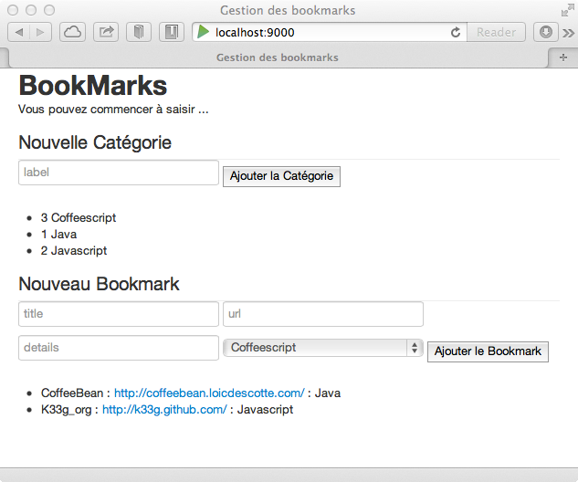
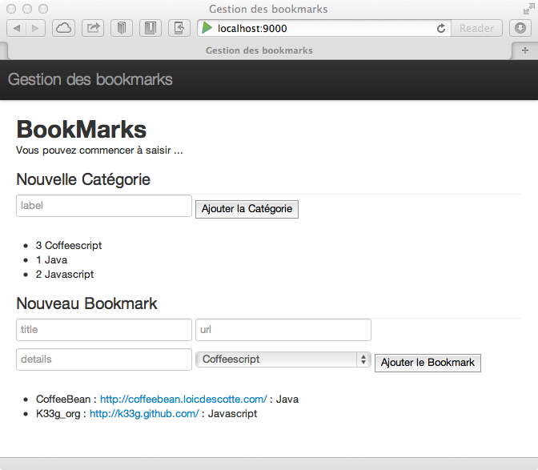

#Un peu de cosmétique

	/* --- Qu'allons nous voir ? ---

		- Une petite récréation : comment rendre un site web "beau" alors que l'on est une bille en design ?

		... Ce n'est pas du Play!►, mais ça va faire joli :)
	*/

Le framework css à la mode, en ce moment c'est Twitter Bootstrap. Il permet à tout développeur web le plus nul en design de donner un aspect "pro" & "joli" à ses pages web. Alors certains me diront : "on va tous avoir des sites avec la même tête !", et je répondrais : "certes, mais au moins, ils seront propres, sobres, ... et puis rien ne vous empêche ensuite d'aller un peu modifier les couleurs". Toujours est-il que c'est plus agréable de travailler avec quelque chose de joli et ça me donne l'opportunité de vous expliquer où sont les ressources statiques dans une application Play!►.

##Prérequis

- Allons télécharger **Bootstrap** : [http://twitter.github.com/bootstrap/assets/bootstrap.zip](http://twitter.github.com/bootstrap/assets/bootstrap.zip)
- Dé-zippez, vous obtenez un répertoire `bootstrap`
- Allez copier ce répertoire dans le répertoire `public` de notre application


##Utilisation

Si vous allez dans le répertoire `app/views` de notre application, vous remarquerez le fichier `main.scala.html`. En fait on pourrait dire que le fichier (la vue) `index.scala.html` utilise `main.scala.html`. Remarquez dans `index.scala.html` la ligne :

	@main("Gestion des bookmarks") { ... }

et dans `main.scala.html` :

	@(title: String)(content: Html)

`index` "appelle" `main` en lui passant en paramètre le titre de la page et le contenu HTML.
Et c'est dans `main.scala.html` que sont déclarées les ressources javascript et css avec la commande `@routes.Assets.at`.

###Modifions le code de `main.scala.html`

```html

	@(title: String)(content: Html)
	
	<!DOCTYPE html>
	
	<html>
		<head>
			<title>@title</title>
			<meta http-equiv="Content-Type" content="text/html; charset=utf-8">
			<link rel="stylesheet" media="screen" href="@routes.Assets.at("bootstrap/css/bootstrap.css")">
			<style>
				body {
					padding-top: 60px;
					padding-bottom: 40px;
				}
			</style>
			<link rel="stylesheet" media="screen" href="@routes.Assets.at("bootstrap/css/bootstrap-responsive.css")">
			<link rel="shortcut icon" type="image/png" href="@routes.Assets.at("images/favicon.png")">
			<script src="@routes.Assets.at("javascripts/jquery-1.7.1.min.js")" type="text/javascript"></script>
		</head>
		<body>
			@content
		</body>
	</html>
```

	//TODO : donner un peu d'explications
	
Vous pouvez rafraîchir votre page, c'est déjà beaucoup plus sympa :



####Customisons légèrement `main.scala.html` 

Modifiez le tag `<body>` de la façon suivante :

```html

	<body>
    	
    	<div class="navbar navbar-fixed-top">
    		<div class="navbar-inner">
    			<div class="container">
    				<a class="brand">@title</a>
    			</div>
    		</div>
    	</div>
    	<div class="container">
    		@content
    	</div>
    	
    </body>
```

Vous pouvez rafraîchir votre page à nouveau, ça prend forme ... :



####Allons customiser légèrement `index.scala.html` 

Vous pouvez remplacer les tags `<legend>` par `<h2>`
Ajoutez la classe `btn` aux tags `<button class="btn">`, pour avoir des boutons arrondis
Remplacez le tag `<p>@message</p>` par `<h6>@message</h6>`


Bref, amusez vous !


