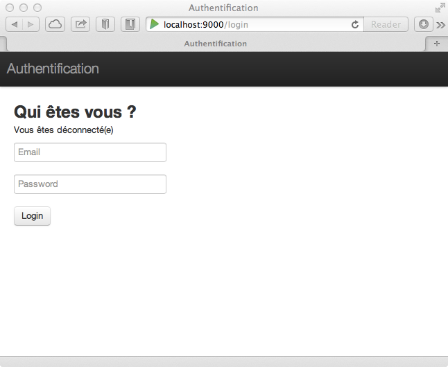
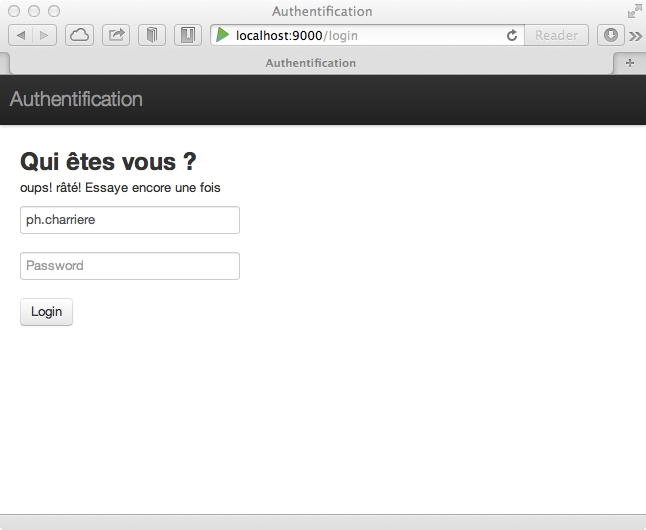
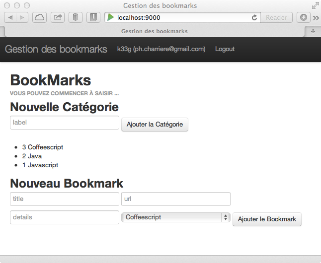
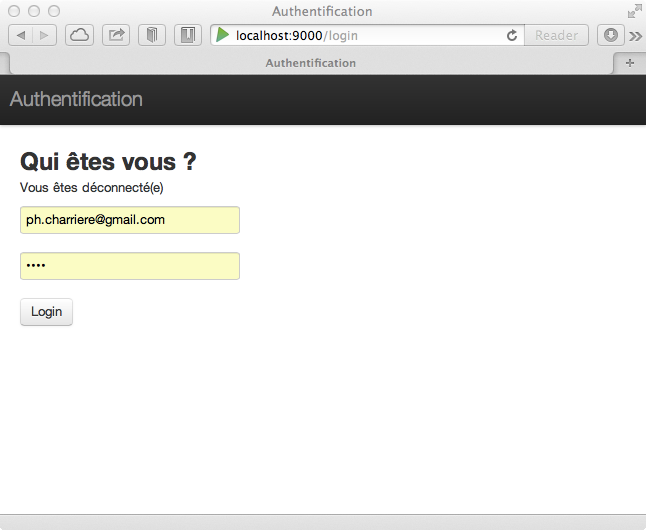

#Gestion de l'authentification

	/* --- Qu'allons nous voir ? ---

		- Comment mettre en oeuvre un système simple d'authentification

		Remarque : la rédaction de ce chapitre reste encore à faire, mais les codes sont complets et vous pouvez les utiliser tels quels.
	*/

Pour que n'importe qui ne puisse saisir pas saisir des bookmarks, nous allons mettre en place un système d'authentification.

##Création d'un modèle User

```java

	//TODO : expliquer ce que fait le code
	package models;
	
	import java.util.*;
	import javax.persistence.*;
	
	import play.db.ebean.Model;
	import play.data.format.*;
	import play.data.validation.*;
	
	
	@Entity 
	public class User extends Model {
	
		@Id
		@Constraints.Required
		@Formats.NonEmpty
		public String email;
	
		@Constraints.Required
		public String name;
	
		@Constraints.Required
		public String password;
	
		public static Model.Finder<String,User> find = new Model.Finder(String.class, User.class);
	
		public static List<User> findAll() {
			return find.all();
		}
	
		public static User findByEmail(String email) {
			return find.where().eq("email", email).findUnique();
		}
	
		public static User authenticate(String email, String password) {
			return find.where()
				.eq("email", email)
				.eq("password", password)
				.findUnique();
		}
	
		public String toString() {
			return "User(" + email + ")";
		}
	
	}
```

##Création d'un contrôleur Secured

```java

	//TODO : expliquer ce que fait le code
	package controllers;
	
	import play.*;
	import play.mvc.*;
	import play.mvc.Http.*;
	
	import models.*;
	
	public class Secured extends Security.Authenticator {
	
		@Override
		public String getUsername(Context ctx) {
			return ctx.session().get("email");
		}
	
		@Override
		public Result onUnauthorized(Context ctx) {
			return redirect(routes.Authentication.login());
		}
	
	}
```

##Allons modifier le contrôleur Application

- Ajout de l'annotation `@Security.Authenticated(Secured.class)`
- Passage du user à la méthode `index.render()`

Code final :

```java

	package controllers;
	
	import play.*;
	import play.mvc.*;
	import play.data.*;
	
	import models.*;
	import views.html.*;
	
	
	@Security.Authenticated(Secured.class)
	public class Application extends Controller {
	
		public static Result index() {
	
			return ok(index.render(
						"Vous pouvez commencer à saisir ...",
						Bookmark.find.fetch("category").orderBy("title").findList(),
						Category.find.orderBy("label").findList(),
						User.find.byId(request().username())
					));
		}
	
	}
```

##Création d'un contrôleur Authentication

```java

	package controllers;
	
	import play.*;
	import play.mvc.*;
	import play.data.*;
	
	import models.*;
	import views.html.*;
	
	
	public class Authentication extends Controller {
	
		public static class AuthenticatedUser {
	
			public String email;
			public String password;
	
			public String validate() {
				if(User.authenticate(email, password) == null) {
					return "oups! râté! Essaye encore une fois";
				}
				return null;
			}
		}
	
		public static Result login() {
			return ok(
				login.render(form(AuthenticatedUser.class))
			);
		}
	
		//On récupère les informations de login (quand le user se "signe")
		public static Result authenticate() {
			Form<AuthenticatedUser> loginForm = form(AuthenticatedUser.class).bindFromRequest();
			if(loginForm.hasErrors()) {
				return badRequest(login.render(loginForm));
			} else {
				session("email", loginForm.get().email);
				return redirect(
					routes.Application.index()
				);
			}
		}
	
		//Fermer la session
		public static Result logout() {
			session().clear();
			flash("success", "Vous êtes déconnecté(e)");
			return redirect(
				routes.Authentication.login()
			);
		}
	
	}
```

##Allons modifier les routes

	# Authentication
	GET     /login                              controllers.Authentication.login()
	POST    /login                              controllers.Authentication.authenticate()
	GET     /logout                             controllers.Authentication.logout()

##Allons modifier main.scala.html et index.scala.html

Nous avons vu que nous passions le user authentifié à la méthode `index.render()` de la vue dans le contrôleur `Application` :

```java

	public static Result index() {
	
		return ok(index.render(
					"Vous pouvez commencer à saisir ...",
					Bookmark.find.fetch("category").orderBy("title").findList(),
					Category.find.orderBy("label").findList(),
					User.find.byId(request().username())
				));
	}
```

Modifions donc le code des formulaires en conséquence :

###main.scala.html

- on ajoute `user` en paramètre : `@(title: String, user: User)(content: Html)` 
- si le `user` est authentifié nous affichons ses informations et la possibilité de se "déloguer" :

```html

		@if(user != null) {
			<ul class="nav">
				<li><a>@user.name <span>(@user.email)</span></a></li>
				<li><a href="@routes.Authentication.logout()">Logout</a></li>
			</ul>
		}
```

Le code définitif va donner ceci :

```html

	@(title: String, user: User)(content: Html)
	
	<!DOCTYPE html>
	
	<html>
		<head>
			<title>@title</title>
			<meta http-equiv="Content-Type" content="text/html; charset=utf-8">
			<link rel="stylesheet" media="screen" href="@routes.Assets.at("bootstrap/css/bootstrap.css")">
			<style>
				body {
					padding-top: 60px;
					padding-bottom: 40px;
				}
			</style>
			<link rel="stylesheet" media="screen" href="@routes.Assets.at("bootstrap/css/bootstrap-responsive.css")">
			<link rel="shortcut icon" type="image/png" href="@routes.Assets.at("images/favicon.png")">
			<script src="@routes.Assets.at("javascripts/jquery-1.7.1.min.js")" type="text/javascript"></script>
		</head>
		<body>
	
			<div class="navbar navbar-fixed-top">
				<div class="navbar-inner">
					<div class="container">
						<a class="brand">@title</a>
						@if(user != null) {
							<ul class="nav">
								<li><a>@user.name <span>(@user.email)</span></a></li>
								<li><a href="@routes.Authentication.logout()">Logout</a></li>
							</ul>
						}
					</div>
				</div>
			</div>
	
			<div class="container">
				@content
			</div>
	
		</body>
	</html>
```

###Il faut aussi modifier index.scala.html

En effet, `index` utilisant `main`, nous devons ajouter la notion de `user`, il y a juste le début à modifier :

Vous vous souvenez, dans `Application` nous avons modifié l'appel de `index.render()` :

	@(
	message: String,
	bookmarks: List[models.Bookmark],
	categories: List[models.Category],
	user: User
	)

et la modification précédente de `main.scala.html` implique le passage du paramètre `user` à `@main()` :

	@main("Gestion des bookmarks", user) { ...


##Allons créer un formulaire de login / Vue

Nous y sommes presque. Il faut créer le formulaire de login : créez dans le répertoire `views` un fichier `login.scala.html` avec le code suivant :

```html

	@(form: Form[Authentication.AuthenticatedUser])
	
	@main("Authentification", null) {
	
		@helper.form(routes.Authentication.authenticate) {
	
			<h2>Qui êtes vous ?</h2>
	
			@if(form.hasGlobalErrors) { 
				<p class="error">@form.globalError.message</p>
			}
	
			@if(flash.contains("success")) {
				<p class="success">@flash.get("success")</p>
			}
	
			<p><input type="email" name="email" placeholder="Email" value="@form("email").value"></p>
			<p><input type="password" name="password" placeholder="Password"></p>
			<p><button class="btn" type="submit">Login</button></p>
		}
	}
```

##Allons ajouter des users dans initial-data.yml

###Ajoutons des utilisateurs :

Cela permettra de se connecter, donc dans le fichier `initial-data.yml`, ajouter ceci (ou quelque chose d'approchant) :

	# Users
	
	users:
	
		- !!models.User
			email:      ph.charriere@gmail.com
			name:       k33g
			password:   play
	
		- !!models.User
			email:      bob@morane.com
			name:       bob
			password:   indochine

Ainsi, nous aurons 2 utilisateurs au chargement de l'application. Et pour les charger, nous allons modifier le fichier `Global.java`

###Modifions Global.java

```java

	import play.*;
	import play.libs.*;
	import java.util.*;
	import com.avaje.ebean.*;
	import models.*;
	
	public class Global extends GlobalSettings {
	
		public void onStart(Application app) {
			InitialData.insert(app);
		}
	
		static class InitialData {
	
			public static void insert(Application app) {
	
				Map<String,List<Object>> all = (Map<String,List<Object>>)Yaml.load("initial-data.yml");
	
				if(Ebean.find(User.class).findRowCount() == 0) {                
					Ebean.save(all.get("users"));   
				}
	
				if(Ebean.find(Category.class).findRowCount() == 0) {
					// Insert categories first
					Ebean.save(all.get("categories"));                
				}
			}
		}
	}
```

C'est bon vous pouvez lancer l'application à nouveau.






