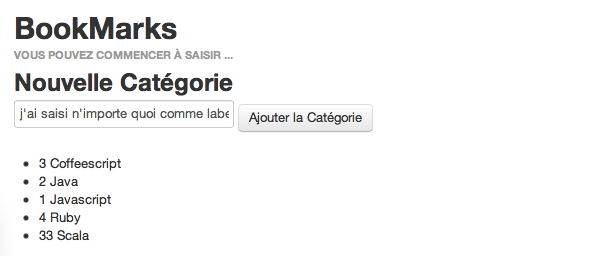
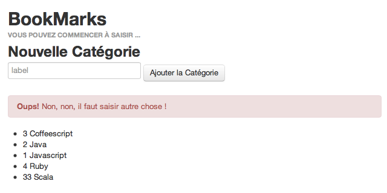
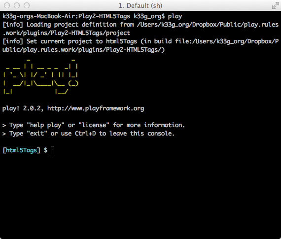

#Validation des données

>*Qu'allons nous voir ?*

>	- *comment définir des contraintes sur un modèle*
>	- *comment vérifier les données d'un formulaire*
>	- *comment valider les données côté client en utilisant un module tiers*

##Enrichissement du modèle et vérification des données

Nous voulons nous assurer que l'utilisateur entre bien un label (d'une catégorie) lors de la création d'un bookmark. Nous voulons aussi limiter la taille à 30 caractères (pourquoi pas?).
Pour cela nous allons utiliser les annotations @Required et @MaxLength dans notre modèle `Category` sur le "champ" `label` (on n'oublie pas : `import play.data.validation.Constraints)`:

```java

	package models;

	import play.db.ebean.Model;
	import javax.persistence.*;
	import play.data.validation.Constraints;

	@Entity
	public class Category extends Model {

		@Id
		public Long id;

		@Constraints.Required
		@Constraints.MaxLength(30)
		public String label;

		// ...
	}

```

Ceci nous permettra ensuite de vérifier l'intégrité des données lors de la soumission du formulaire (= lorsque l'on ajoute une catégorie). Modifions un peu le code de notre contrôleur `Categories` :

```java
	
	public class Categories extends Controller {

	    public static Result add() {

	        final Form<Category> categoryForm = form(Category.class).bindFromRequest();

	        if (categoryForm.hasErrors()) { // <--- le code modifié, ça commence ici !

				flash("error", "Non, non, il faut saisir autre chose !");

			} else { // <--- on n'enregistre que si tout va bien
				final Category category = categoryForm.get();
				category.save();	
			}

	        return redirect(routes.Application.index());

	    }
	}
	
```

En cas de problème on renvoie une erreur à notre template.

Pour afficher cette erreur on peut ajouter ceci à notre fichier `index.scala.html` : 

```scala

	@if(flash.containsKey("error")) {
		<div class="alert alert-error"> <!-- ceci est un style twitter bootstrap -->
			<strong>Oups!</strong> @flash.get("error")
		</div>
	}

```

**Vous pouvez tout de suite essayer :**

\

\


Il existe d'autres annotations de validation : 

 * `@Max` et `@Min` pour les valeurs numériques
 * `@MinLength` pour demander une taille longueur minimum à un champ
 * `@Pattern` qui permet de valider des expressions régulières
 * `@Email` pour valider le format email

On peut bien sûr écrire facilement nos propres validateurs...

##Validation côté client

Avec HTML5, il est possible de valider des données d'un formulaire directement depuis le navigateur avant de les envoyer au serveur.

Il existe un module Play (développé par un de vos serviteurs : [@loic_d](http://www.twitter.com/loic_d)) que vous trouverez ici :  [https://github.com/loicdescotte/Play2-HTML5Tags](https://github.com/loicdescotte/Play2-HTML5Tags), pour générer les bonnes balises HTML à partir des contraintes du modèle.

Avant de l'utiliser, voyons comment l'installer.

###Installation de Play2-HTML5Tags

Pour le moment il n'existe pas de repository public pour les modules Play2!>, donc téléchargez sur le site le plugin (utilisez le bouton "zip" ou directement le lien [https://github.com/loicdescotte/Play2-HTML5Tags/zipball/master](https://github.com/loicdescotte/Play2-HTML5Tags/zipball/master)).
Une fois le module téléchargé, dé-zippez, allez dans le répertoire du module :

**Les versions de Play, Sbt, ... ont une importance "VITALE" ;)**, il faut donc aller modifier quelques petits paramètres en fonction de la version de Play que vous utilisez, mais **seulement si c'est nécessaire**, ce n'est utile que dans les cas où la version du module a été développé pour une version antérieur de Play (par exemple version 2.0.1 contre version 2.0.2). Si c'est le cas vous aurez les 2 manipulations ci-dessous à effectuer :

- dans le répertoire `/projet` changez dans `build.properties` `sbt.version=0.11.2` par `sbt.version=0.11.3`
- dans le répertoire `/projet` changez dans `plugins.sbt` `addSbtPlugin("play" % "sbt-plugin" % "2.0")` par `addSbtPlugin("play" % "sbt-plugin" % "2.0.2")`

*PS: bien sûr cela change en fonction des versions de Play.*

Ensuite dans le répertoire du module, en mode console, tapez : `play`, cela va "mouliner" un petit moment, vous devriez ensuite obtenir un prompt avec le nom du module :

\

Ensuite, au prompt, tapez `publish-local`, là encore cela mouline un moment, Play compile et installe le plugin pour qu'il soit utilisable par toutes vos applications Play. Vous pouvez allez vérifier dans le répertoire d'installation de Play, dans `/repository/local` vous avez maintenant un répertoire `com.loicdescotte.coffeebean` qui contient le module `html5tags_2.9.1`.

###Déclaration de Play2-HTML5Tags

Avant de pouvoir utiliser le module, vous devez déclarer son utilisation dans votre application. Il va donc falloir modifier le fichier `/project/Build.scala` de votre application Play :

```scala

	import sbt._
	import Keys._
	import PlayProject._

	object ApplicationBuild extends Build {

	    val appName         = "bookmarks"
	    val appVersion      = "1.0-SNAPSHOT"

	    val appDependencies = Seq(
	      // Add your project dependencies here,
	      "com.loicdescotte.coffeebean" % "html5tags_2.9.1" % "1.0-SNAPSHOT"
	    )

	    val main = PlayProject(appName, 
	    						appVersion, appDependencies, mainLang = JAVA).settings(
	      // Add your own project settings here 
	      resolvers += "Local Play Repository" at "/Users/k33g_org/play-2.0.2/repository"     
	    )
	}
```

Maintenant vous pouvez utiliser le module.

###Utilisation de Play2-HTML5Tags

Dans le cas de notre application de gestion de bookmarks, on va pouvoir remplacer ceci : 

```html

	<input name="label" placeholder="label">
```

Par cela :

```scala

	@text(categoryForm("label"), 'placeholder -> "LABEL : ")
```

Et le "markup" approprié sera généré :

```html

	<input name="url" placeholder="url" maxlength="30" required>
```

Le navigateur vérifiera alors la présence et la longueur du champ avant d'envoyer les données au serveur, ce qui permettra à l'utilisateur d'avoir un retour d'erreur plus rapide en case de problème et d'économiser un peu de bande passante!

**Mais pour que cela fonctionne, quelques manipulations sont encore nécessaires :**

Créons un modèle User (il nous reservira plus tard)

```java

	package models;
	
	import java.util.*;
	import javax.persistence.*;
	
	import play.db.ebean.Model;
	import play.data.format.*;
	import play.data.validation.*;
	
	
	@Entity 
	public class User extends Model {
	
		@Id
		@Constraints.Required
		@Formats.NonEmpty
		public String email;
	
		@Constraints.Required
		public String name;
	
		@Constraints.Required
		public String password;
	
		public static Model.Finder<String,User> find = 
			new Model.Finder(String.class, User.class);
	
		public static List<User> findAll() {
			return find.all();
		}
	
		public static User findByEmail(String email) {
			return find.where().eq("email", email).findUnique();
		}
	
		public String toString() {
			return "User(" + email + ")";
		}
	
	}
```

Dans le contrôleur `Application.java`, ajoutons `form(Category.class)` en argument de la méthode `index.render()` :

```java

	public class Application extends Controller {

	    public static Result index() {

	        return ok(index.render(
	                    "Vous pouvez commencer à saisir ...",
	                    Bookmark.find.fetch("category").orderBy("title").findList(),
	                    Category.find.orderBy("label").findList(),
	                    User.find.byId(request().username()),
	                    form(Category.class) //<--- c'est ici
	                ));
	    }

	}
```

Puis, dans la vue `index.scala.html`, déclarons ce nouveau paramètre :

```scala

	@(
	message: String,
	bookmarks: List[models.Bookmark],
	categories: List[models.Category],
	user: User,
	categoryForm: Form[models.Category]
	)
```

Ajoutons tout de suite après ceci (spécifique au module que nous avons installé):

```scala

	@import html5.tags.html._
```

Maintenant nous pouvons remplacer `<input name="label" placeholder="label">` par `@text(categoryForm("label"), 'placeholder -> "saisir un label")` et vous obtiendrez ceci :


Si vous ne souhaitez pas voir apparaître les contraintes de saisie, utilisez plutôt : `@text(categoryForm("label"), 'placeholder -> "saisir un label", '_showConstraints -> false)`.

**Remarque :** Le fait de référencer un objet `categoryForm` nous permettra si on le souhaite plus tard d'éditer une catégorie existante en remplissant directement le champ du formulaire avec la valeur de notre objet. On pourrait par exemple écrire quelque chose comme ça dans le contrôleur (ceci est un exemple sans lien avec le code du tuto) :

```java

	public static Result edit(Long id) {
		Form<Category> categoryForm = form(Category.class).fill(
			Category.find.byId(id)
		);
		return ok(
			edit.render(id, categoryForm)
		);
	}
```

Le tag `text` tag est capable de changer le type de `<input>` si une annotation particulière est détectée. 

Par exemple avec le modèle suivant :

```java

	@Constraints.Email
	public String contactMail;
```
    
Et ce tag :

```scala
  
	@text(form("contactMail"))
```

On obtiendra ceci :

```html

	<input type="email" id="contactMail" name="contactMail" value="">
```

Et le navigateur vérifiera le format saisi :

\


HTML5 reconnait de nouveaux type de données dans les formulaires, comme les nombres, les dates, les numéros de téléphone, les URL....
Le module prend en charge ces types de données à travers des tags particuliers (`@number`, `@date`, `@telephone`, `@url` ...)

Le fait de préciser le type de `<input>` permet également au navigateur, particulièrement sur mobile, d'adapter son IHM au format demandé. 
Par exemple pour un champ numérique : 
 
\

