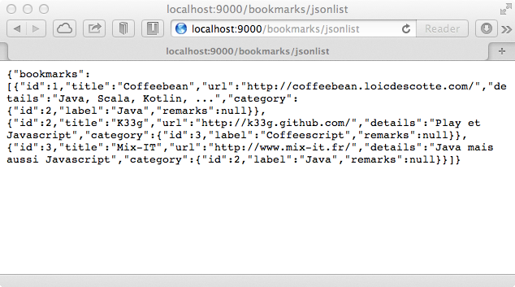
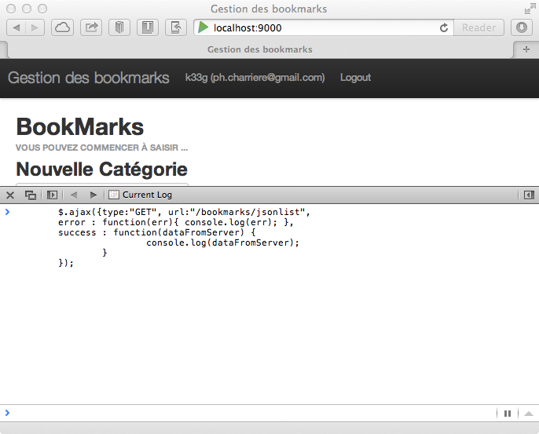
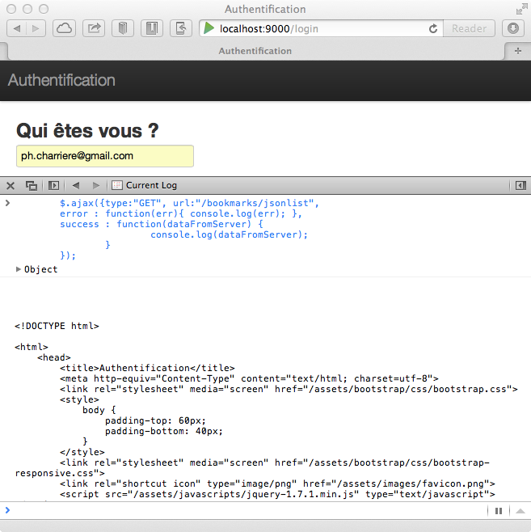
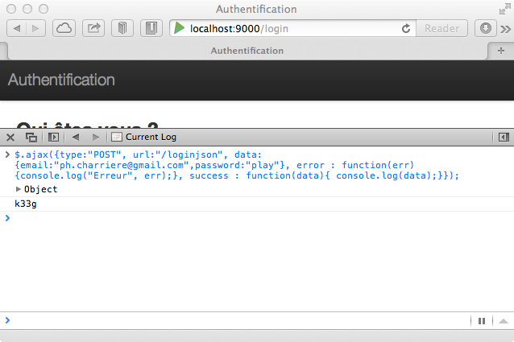
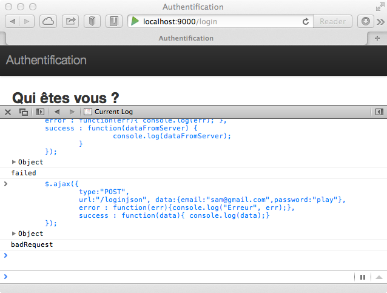
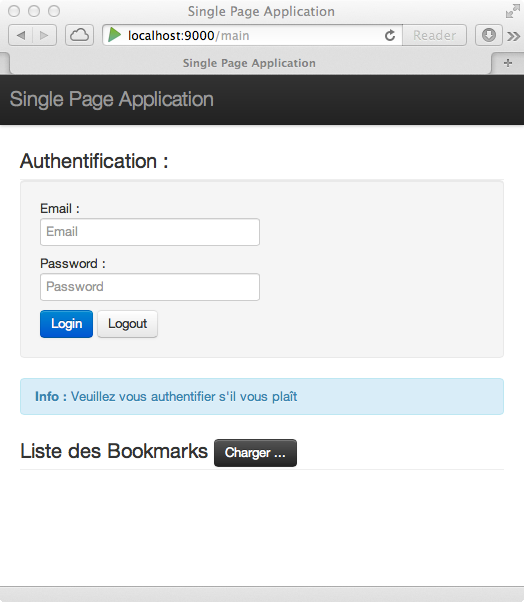
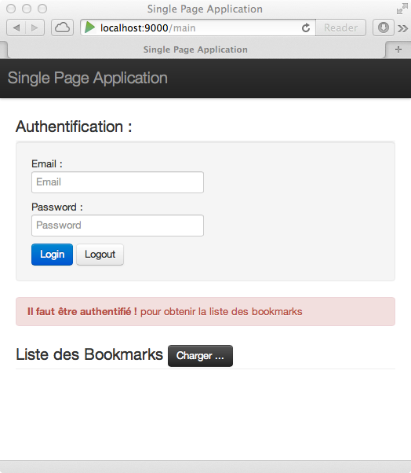
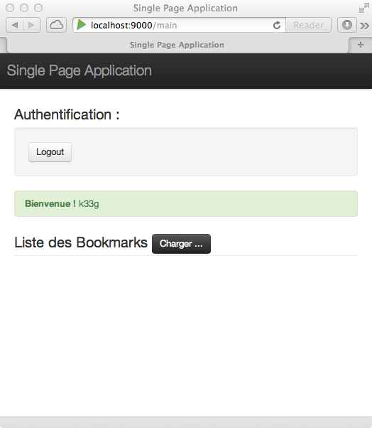
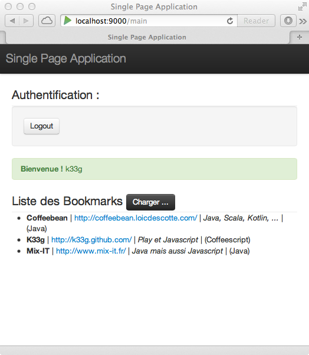

#Services (JSON)

>*Qu'allons nous voir ?*

>	- *comment faire un service json*
>	- *comment sécuriser ce service*
>	- *comment s'authentifier via ajax*
>	- *comment faire une "single page application"*

##Primo :

Ajoutons quelques bookmarks dans notre applications :

\


##Création de notre service JSON

**Objectif :** faire un service qui nous renvoie la liste des bookmarks au format JSON

###Allons modifier le contrôleur Bookmarks

*bookmarks.java dans app/controllers*

####import(s)

```java

	import java.util.HashMap;
	import java.util.List;
	import java.util.Map;

	import static play.libs.Json.toJson;
```

####Ajout de la méthode jsonList()

```java

	public static Result jsonList() {
	    Map<String, List<Bookmark>> data = new HashMap<String, List<Bookmark>>();
	    List<Bookmark> list = Bookmark.find.orderBy("title").findList();
	    data.put("bookmarks", list);
	    return ok(toJson(data));
	}
```

####Modifions le fichier routes

Nous ajoutons la route suivante :

	#Services
	GET /bookmarks/jsonlist controllers.Bookmarks.jsonList()


####Donc le code final est le suivant :

```java

	package controllers;

	import models.Bookmark;

	import play.*;
	import play.mvc.*;
	import play.data.*;

	import java.util.HashMap;
	import java.util.List;
	import java.util.Map;

	import static play.libs.Json.toJson;

	public class Bookmarks extends Controller {

	    public static Result add() {

	        final Form<Bookmark> bookmarkForm = form(Bookmark.class).bindFromRequest();
	        final Bookmark bookmark = bookmarkForm.get();

	        bookmark.save();
	        return redirect(routes.Application.index());

	    }

	    public static Result jsonList() {
	        Map<String, List<Bookmark>> data = new HashMap<String, List<Bookmark>>();
	        List<Bookmark> list = Bookmark.find.orderBy("title").findList();
	        data.put("bookmarks", list);
	        return ok(toJson(data));
	    }


	}
```

Donc, lorsque nous appellerons l'url `localhost:9000/bookmarks/jsonlist`, nous obtiendrons la liste des bookmarks au format JSON.

##Utilisation du service JSON

###Directement avec l'url

Dans la zone de saisie de l'url de votre navigateur, saisissez donc `localhost:9000/bookmarks/jsonlist`. Et vous obtenez le flux JSON de vos bookmarks :

\


###Plus utile : via une requête ajax

Comme vous le savez (ou pas), Play2!> est fourni avec **jQuery**, "petit" framework javascript très utile pour "jouer" avec le DOM de vos pages, mais aussi pour faire des requêtes ajax.
Si vous vous souvenez, dans la vue (portion de vue) `main.scala.html` il y avait le code suivant :

	<script src="@routes.Assets.at("javascripts/jquery-1.7.1.min.js")" 
		type="text/javascript"></script>

Ce qui signifie que toute vue "utilisant" `main.scala.html`, comme par exemple `index.scala.html` (vous trouverez la déclaration `@main(...)` dans le code), charge **jQuery**. Donc, 

- retournez dans votre navigateur, mais cette fois-ci à la racine de votre site (probablement `http://localhost:9000`) 
- ouvrez la console de votre navigateur (click droit + "Inspect Element")
- et Tapez ceci :


```javascript

	$.ajax({type:"GET", url:"/bookmarks/jsonlist",
    	error : function(err){ console.log(err); },
    	success : function(dataFromServer) { 
			console.log(dataFromServer); 
		}
	});
```

\

Vous obtenez directement un objet `bookmarks` qui est un tableau d'objets avec les éléments attendus :

\

Et vous remarquerez  ...

\

... que les objets `bookmark` du tableau `bookmarks` contiennent les objets "liés" `category`.

**Génialement simplissime et pratique, non !?**

**Attention : dans mon exemple le service n'est pas sécurisé**

##Sécurisation

Sécurisons notre contrôleur `Bookmarks.java` en lui ajoutant l'annotation `@Security.Authenticated(Secured.class)`. Ensuite (après recompilation), retournez à la racine du site `localhost:9000` pour vous "deloguer". Puis relancez votre requête ajax, et là vous obtenez (curieusement ?) le code HTML de la page d'authentification en retour. Ce qui est rassurant, c'est que notre service est bien sécurisé, mais le code de retour n'est pas forcément "top" à gérer.

\

En fait, dans notre classe `Secured.java` nous avions la méthode suivante :

	@Override
	public Result onUnauthorized(Context ctx) {
		return redirect(routes.Authentication.login());
	}

Donc, si vous n'êtes pas authentifié, vous êtes redirigé vers la page d'authentification, d'où la récupération du code HTML dans notre requête ajax.

Nous allons donc créer une classe du même type que `Secured.java` mais dédiée aux appels JSON.

###SecuredJson.java

```java

	package controllers;

	import play.*;
	import play.mvc.*;
	import play.mvc.Http.*;

	import models.*;

	import static play.libs.Json.toJson;

	public class SecuredJson extends Security.Authenticator {

		@Override
		public String getUsername(Context ctx) {
			return ctx.session().get("email");
		}

		@Override
		public Result onUnauthorized(Context ctx) {
			return ok(toJson("failed"));
		}

	}
```

###Modification de l'annotation dans Bookmarks.java

Remplacez `@Security.Authenticated(Secured.class)` par : 

	`@Security.Authenticated(SecuredJson.class)`

###Testons

Lancez à nouveau, dans la console du navigateur, votre requête ajax :

\


###Mais comment puis m'authentifier via une requête ajax ???

Là aussi, nous allons devoir créer une classe du même type qu'`Authentication.java` mais qui ne redirige pas vers la page principale pour ne pas avoir du code HTML comme retour.

####AuthenticationJson.java

**Remarque :** *Je pourrais hériter de Authentication.java, mais pour le moment je vais dupliquer le code et le modifier.*

```java

	package controllers;

	import play.*;
	import play.mvc.*;
	import play.data.*;

	import models.*;
	import views.html.*;

	import static play.libs.Json.toJson;

	public class AuthenticationJson extends Controller {

		public static class AuthenticatedUser {

			public String email;
			public String password;

			public String validate() {
				if(User.authenticate(email, password) == null) {
					return "oups";
				}

				return null;
			}
		}

		//On récupère les informations de login (quand le user se "signe")
		public static Result authenticate() {
			Form<AuthenticatedUser> loginForm = 
				form(AuthenticatedUser.class).bindFromRequest();

			if(loginForm.hasErrors()) {
				return ok(toJson("badRequest"));

			} else {
				session("email", loginForm.get().email);
				User who = User.findByEmail(loginForm.get().email);
				return ok(toJson(who.name)); 
			}
		}

		//Fermer la session
		public static Result logout() {
			session().clear();
			return ok(toJson("bye"));
		}

	}
```

####Ajoutons les routes

	POST    /loginjson                          controllers.AuthenticationJson.authenticate()
	GET     /logoutjson                         controllers.AuthenticationJson.logout()


####Testons

Dans la console du navigateur, essayez la commande suivante (vous ne devez pas être authentifié) :

```javascript

	$.ajax({
		type:"POST", 
		url:"/loginjson", data:{email:"ph.charriere@gmail.com",password:"play"}, 
		error : function(err){console.log("Erreur", err);}, 
		success : function(data){ console.log(data);}
	});
```

Vous allez obtenir ceci :

\

Et si vous rappelez l'url `http://localhost:9000`, vous apparaissez comme authentifié. Vous pouvez tester à nouveau votre requête pour récupérer la liste des bookmarks :

```javascript

	$.ajax({type:"GET", url:"/bookmarks/jsonlist",
    	error : function(err){ console.log(err); },
    	success : function(dataFromServer) { 
			console.log(dataFromServer); 
		}
	});
```

Si vous souhaitez vous délogguer (toujours via une requête Ajax) :

```javascript

	$.ajax({
		type:"GET", 
		url:"/logoutjson", 
		error : function(err){console.log("Erreur", err);}, 
		success : function(data){ console.log(data);}
	});
```

\

Et si vous rappelez l'url `http://localhost:9000`, vous n'êtes plus authentifié.

\

Si vous testez à nouveau votre requête pour récupérer la liste des bookmarks, vous aurez un message vous indiquant que ce n'est pas possible (`failed`) car non autorisé (cf. `SecuredJson.java`):

\
	
De la même manière, si vous tentez de vous authentifier avec un mauvais compte utilisateur :

```javascript

	$.ajax({
		type:"POST", 
		url:"/loginjson", data:{email:"sam@gmail.com",password:"play"}, 
		error : function(err){console.log("Erreur", err);}, 
		success : function(data){ console.log(data);}
	});
```

Vous obtiendrez un message badRequest (cf. `AuthenticationJson.java`) :

\


##Utilisons tout ça ...

Mettons en applications ce que nous venons de voir pour faire quelque chose d'un peu plus "pratique" : développons une "Single page application" :

- nous allons pouvoir nous authentifier
- nous allons pouvoir charger les bookmarks
- il n'y aura auncun rechargement de page (à part la 1ère fois)

Commençons par créer un nouveau contrôleur :

###Nouveau Contrôleur : SingleApp.java

Alors, c'est très simple, dans le répertoire `controllers`, créez un nouveau contrôleur avec le nom `SingleApp.java` :

```java

	package controllers;

	import play.*;
	import play.mvc.*;
	import play.data.*;

	import models.*;
	import views.html.*;

	public class SingleApp extends Controller {
        
	    public static Result mainPage() {
    
	        return ok(mainPage.render(
	                    "Single Page Application"
	                ));
	    }

	}
```

###routes

Ajoutons une route dans le fichier `routes` : 

	# Main Single Page Application
	GET		/main 						controllers.SingleApp.mainPage()

Finalement le **gros** du travail va se faire en html et javascript. Nous disposons de jQuery (c'est fourni en standard avec Play!>), et si vous vous souvenez, nous avons installé Twitter Bootstrap. Nous allons donc voir comment faire une "single page application", donc plus notions de templating : **je vais utiliser une vue "scala" mais qui ne contiendra que le minimum de code scala** (dans l'absolu nous pourrions utiliser une simple page html).

###Nouvelle vue : mainPage.scala.html

Commencez par créer une nouvelle vue (dans le répertoire `views`) que vous nommerez `mainPage.scala.html`. Je suis reparti (copier/coller ... je sais) de `main.scala.html`. Je ne fais que reprendre les requêtes "ajax" que nous avons utilisées précédement pour tester nos services json.

**Attention :** mon code javascript n'est pas forcément compatible avec tous les navigateurs, je suis allé au plus simple et j'ai utilisé les possibilités de la dernière version de javascript (par exemple : le `forEach` sur un `array`).

```html

	@(title: String)
	<!DOCTYPE html>

	<html>
	    <head>
	        <title>@title</title>
	        <meta http-equiv="Content-Type" content="text/html; charset=utf-8">
	        <link rel="stylesheet" media="screen" 
	        	href="@routes.Assets.at("bootstrap/css/bootstrap.css")">
	        <style>
	            body {
	                padding-top: 60px;
	                padding-bottom: 40px;
	            }
	        </style>
	        <link rel="stylesheet" media="screen" 
	        	href="@routes.Assets.at("bootstrap/css/bootstrap-responsive.css")">
	        <link rel="shortcut icon" type="image/png" 
	        	href="@routes.Assets.at("images/favicon.png")">
	        <script src="@routes.Assets.at("javascripts/jquery-1.7.1.min.js")" 
	        	type="text/javascript"></script>
	    </head>
	    <body>

	        <div class="navbar navbar-fixed-top">
	            <div class="navbar-inner">
	                <div class="container">
	                    <a class="brand">@title</a>

	                </div>
	            </div>
	        </div>

	        <div class="container">
				<!-- === Formulaire d'authentification === -->
				<fieldset>
					<legend>Authentification :</legend>
					<div class="well">
						<label>Email : 
						<input type="email" name="email" placeholder="Email"></label>
						<label>Password : 
						<input type="password" name="password" 
							placeholder="Password"></label>
						<button name="login" class="btn btn-primary">Login</button>
						<button name="logout" class="btn">Logout</button>
					</div>
				</fieldset>

				<!-- === Les messages s'afficheront ici === -->
				<div name="authentication" class="alert alert-info">
				  <strong>Info : </strong> Veuillez vous authentifier s'il vous plaît
				</div>

				<!-- === Les bookmarks s'afficheront ici === -->
				<fieldset>
					<legend>Liste des Bookmarks <button name="loadbookmarks" 
						class="btn btn-inverse">Charger ...</button></legend>
					<ul name="bookmarks"></ul>
				</fieldset>

	        </div>

	    </body>

		<!-- === ici votre code applicatif === -->
		<script>
		    /*=== mon code ne s'exécute qu'une fois le DOM complètement chargé ===*/
		    $(function (){

				//définition des différents éléments d'IHM
				var user = {}
				,	alertAuthentication = $('div[name=authentication]')
				,	loginButton = $("button[name=login]")
				,	logoutButton = $("button[name=logout]")
				,	loadBookmarksButton = $("button[name=loadbookmarks]")
				,	email = $('input[name=email]')
				,	password = $('input[name=password]')
				,	labels = $('label')
				,	bookmarksList = $('ul[name=bookmarks]');

				// onclick du bouton login
				loginButton.click(function(){

					user.email = email.val();
					user.password = password.val();
					$.ajax({
						type:"POST", 
						url:"/loginjson", data:{
							email : user.email, 
							password : user.password 
						}, 
						error : function(err){console.log("Erreur", err);}, 
						success : function(data){
							if(data !== "badRequest") {
								alertAuthentication
									.attr('class','alert alert-success')
									.html('<strong>Bienvenue !</strong> ' + data);
								user.name = data;

								labels.hide();
								email.hide();
								password.hide();
								loginButton.hide();

							} else {
								alertAuthentication
								 .attr('class','alert alert-error')
								 .html('<strong>Oups !</strong> vous avez du vous tromper');
							}
						}
					});
				});

				// onclick du bouton logout
				logoutButton.click(function(){

					$.ajax({
						type:"GET", 
						url:"/logoutjson", 
						error : function(err){console.log("Erreur", err);}, 
						success : function(data){ 

							if(user.name) {
								alertAuthentication
									.attr('class','alert alert-info')
									.html('<strong>Au revoir</strong> ' + user.name);

									labels.show();
									email.show();
									password.show();
									loginButton.show();

									user = {};

									bookmarksList.html('');
							}


						}
					});
				});

				// onclick du bouton de chargement des bookmarks
				loadBookmarksButton.click(function(){
					$.ajax({type:"GET", url:"/bookmarks/jsonlist",
				    	error : function(err){ console.log(err); },
				    	success : function(data) { 

							if(data !== "failed") {
							  bookmarksList.html('');
							  data.bookmarks.forEach(function(bookmark){
								bookmarksList.append(
								  $('<li>')
									.append($('<b>').append(bookmark.title))
									.append(' | ')
									.append($('<a>').attr("href",bookmark.url)
									.append(bookmark.url))
									.append(' | ')
									.append($('<i>')
									.append(bookmark.details))
									.append(' | (')
									.append(bookmark.category.label).append(')')
								);
							  });
							} else {
							   alertAuthentication
								.attr('class','alert alert-error')
								.html('<strong>Il faut être authentifié !</strong> \n pour obtenir la liste des bookmarks');
							}
						}
					});
				});


		    });
		</script>

	</html>
	
```

##Testons

Dans votre navigateur, appelez l'url : `http://localhost:9000/main`

\

Si vous vous trompez en vous authentifiant :

\

Si vous essayez de charger les bookmarks alors que vous n'êtes pas authentifié :

\

Si vous vous êtes correctement authentifié :

\

Vous pouvez donc charger les bookmarks :

\

Si vous retournez à la racine du site : `http://localhost:9000/`, vous pouvez vérifiez que vous avez effectivemnt été authentifié :

\


##Conclusion

Il est donc finallement très possible de "faire" du **Play!> 2** (java) sans utiliser (ou presque) du scala dans les vues. Pensez-y lorsque vous faites du **Play!> 1** (le mécanisme décrit est tout à fait reproductible dans la version 1), cela peut faciliter vos migrations.

