#Play2!> Initiation

version du moment : RC2/RC3

##Play2!> ???

	//TODO : petit blabla, version java, version scala, les +, les -, etc. ...

##Objectif 

Pas forcément tout voir, je ne vais pas traiter des templates pour cette 1ère fois

##Installation

- attention, vous devez avoir le JDK 6 minimum (Eh oui, vous avez le 7 aussi) : donc attention à ne pas proposer Play2 à des clients étant encore en JDK 5 (si, ça existe encore !)
- télécharger Play2!> : [http://www.playframework.org/2.0](http://www.playframework.org/2.0)
- dézipper quelque part

###Modification du PATH

####Sous OSX (& Linux)
	
	sudo pico ~/.bash_profile
	export PATH=$PATH:/ENDROIT_OU_VOUS_AVEZ_DEZIPPE/play-2.0-RC2

Si vous continuez à jouer avec Play1!> (ce qui est mon cas), dans `play-2.0-RC2` renommez `play` en `play2`

*Remarque : vérifier si le script "play" ou "play2" est exécutable. Sinon tapez `chmod a+x play` ou `chmod a+x play2`.*

####Sous Windows

	//TODO

####On vérifie

Dans une nouvelle fenêtre de Terminal ou de Console, tapez :

	play help

ou (si vous avez suivi)

	play2 help

Cela va mouliner un peu : Play2!> télécharge quelques dépendances :

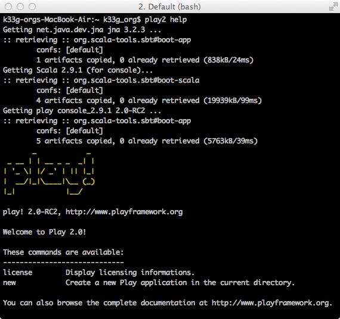

Voilà, ça c'est fait, on peut commencer.

*Remarque : il existe une autre méthode d'installation à partir de sbt*

	//TODO : à développer

##1ère application

Qu'allons nous faire ? ... Des bookmarks, encore des bookmarks

	//TODO

###Génération du squelette de l'application

- Installez vous dans votre répertoire de travail (`cd mon_repertoire_de_travail`)
- Tapez la commande `play new bookmarks`
- validez et suivez les instructions

Play vous propose un nom par défaut pour votre application :  acceptez

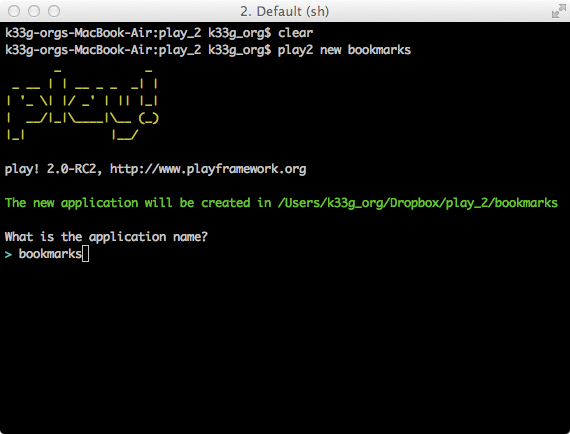

Play vous demande quel type de projet vous souhaitez générer, choisissez la version Java

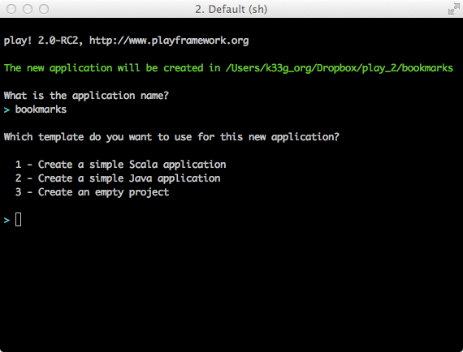

Et hop, c'est fait

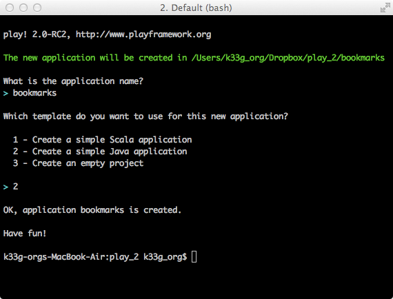

####Allons voir ce qui a été généré :

Un répertoire `bookmarks` a été créé avec ceci "à l'intérieur" :

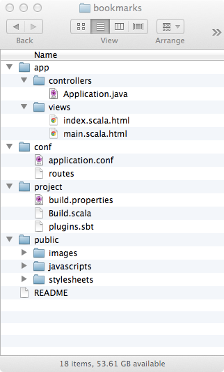

**Mais où est passé le répertoire `models` ???**

####Allez on lance ?

- `cd bookmarks`
- `play` (ou `play2`)

Cela risque de "mouliner" un moment la 1ère fois, Play2!> a pas mal de dépendances à charger.
Et vous arrivez enfin dans la console Play :

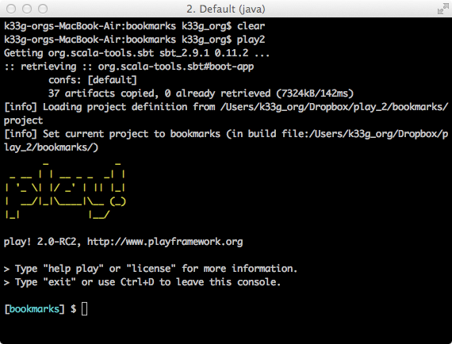

Tapez `run`

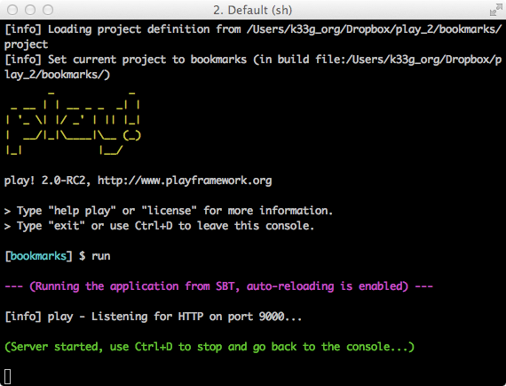

Et allons voir du côté de notre navigateur préféré, ouvrons [http://localhost:9000](http://localhost:9000) :

En parallèle, côté console (côté serveur), ça compile :

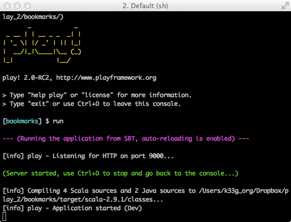

Et au bout de quelques instants, si tout va bien, vous obtenez cette page dans votre navigateur :

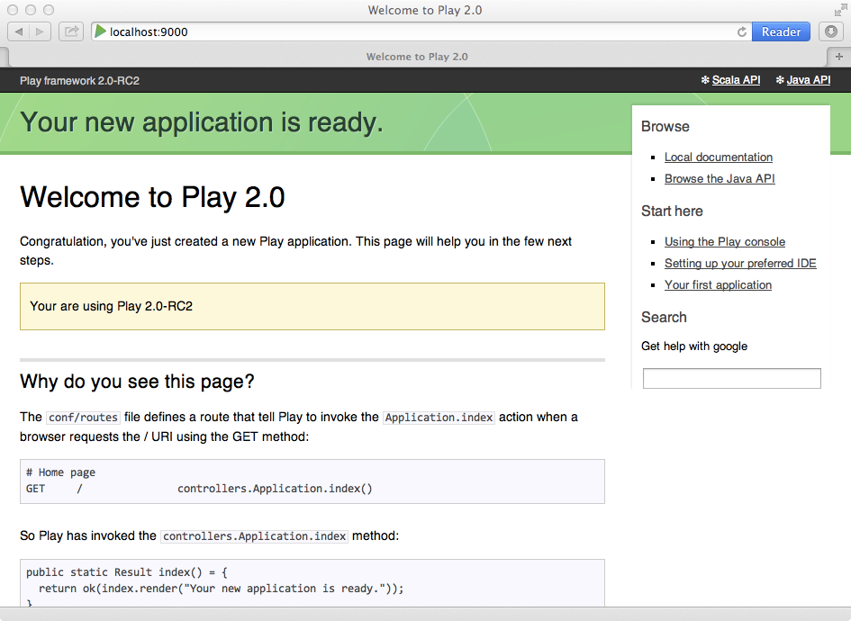

Nous avons donc une installation de Play2!> et un squelette d'application opérationnels. Avant d'aller plus loin, nous allons paramétrer un IDE pour nous faciliter le développement (il est aussi possible d'utiliser un simple éditeur de texte). Play2!> peut fonctionner avec plusieurs IDE :

- Eclipse
- IntelliJ
- NetBeans (il reste à ce jour encore quelques réglages/développements à réaliser)

Je vous propose d'utiliser la version Community d'IntelliJ (qui semble faite pour Play), qui a l'avantage d'être gratuite et puissante à la fois.

##Paramétrage de l'IDE : IntelliJ CE

- Quittez la console play : `Ctrl+c`
- relancez `play` (ou `play2`) (toujours dans le répertoire de votre application)
- une fois que vous êtes au prompt `[bookmarks] $ `, tapez la commande `idea` et validez

Vous devriez obtenir ceci :

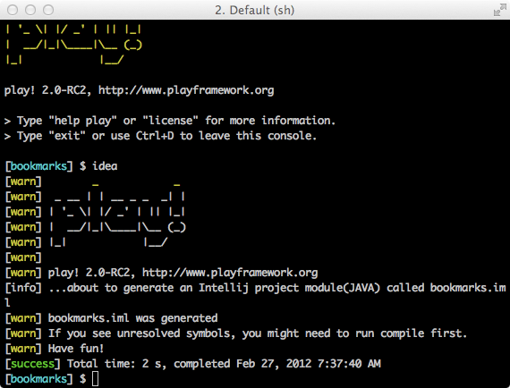

Play a généré dans le répertoire de l'application un fichier `bookmarks.iml`

- Démarrez IntelliJ
- Créez un nouveau projet
- Choisir "Create project from scratch"
- donnez un nom au projet (j'ai choisi de lui donner le même nom que mon application : `bookmarks`)
- faire pointer "Project files location" sur le répertoire de votre application (dans mon cas cela donnerait `/Users/k33g_org/Dropbox/play_2/bookmarks`)
- décochez l'option "Create module"
- cliquez sur "Finish"

IntelliJ va vous afficher une fenêtre "Project Structure" :

- Dans la rubrique "Modules" de "Projects Settings", ajoutez un module (l'icone "+")
- Sélectionnez le choix "import existing module"
- "pointez" vers le fichier `bookmarks.iml` (cans mon cas `/Users/k33g_org/Dropbox/play_2/bookmarks/bookmarks.iml`)
- cliquez sur "Finish"

Vous devriez obtenir l'écran suivant (si vous avez tout fait comme il faut) :

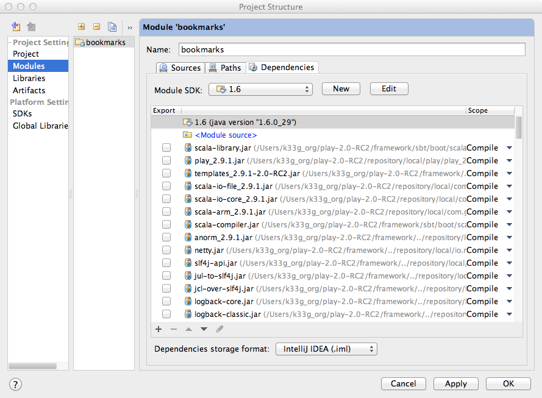

- cliquez sur "OK"

Voilà, vous avez un projet IntelliJ pour votre application

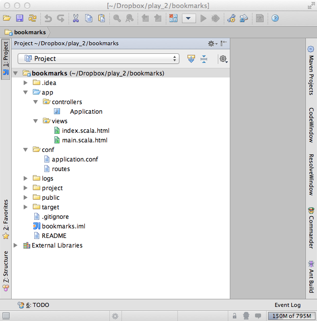

Si vraiment vous souhaitez utiliser un autre IDE, c'est expliqué ici : [https://github.com/playframework/Play20/wiki/IDE](https://github.com/playframework/Play20/wiki/IDE)

##Paramétrage de notre application

###Il nous faut une base de données

Allons faire un tour dans le fichier `conf/application.conf` et ajoutons ceci :

	db.default.driver=org.h2.Driver
	db.default.url="jdbc:h2:file:play"

au niveau de la section :

	# Database configuration
	# ~~~~~ 

Nous avons donc expliqué à Play, que nous souhaitions utiliser la base de données "H2 Database" en mode fichier. Comme cela toutes nos modifications seront persistées.

###Il va nous falloir des modèles

- créez un répertoire `models` dans `app` car ça n'est pas fait automatiquement (pour le moment ?) (dans IntelliJ, utilisez la fonction "New Package"
- dans `conf/application.conf` modifiez la partie `# Ebean configuration` : Décommentez la ligne : `ebean.default=models.*`

##Les modèles

	//TODO : blabla ebean

###Création d'un 1er modèle : Category

Créer une classe dans app/models : Category.java


```java
	package models;

	import play.db.ebean.Model;
	import javax.persistence.*;

	@Entity
	public class Category extends Model {

		@Id
		public Long id;
		public String label;

		public static Finder<Long, Category> find = new Finder<Long, Category>(Long.class, Category.class);

	}

	//TODO : parler des différence avec play1, hibernate versus ebean etc ...
```

- Redémarrez l'application
- connectez vous à [http://localhost:9000/](http://localhost:9000/) dans votre navigateur
- Play!► va vous proposer de créer le modèle de données :
- Clickez sur `apply this script now`


... votre base de données est créée.

###Création d'un 2ème modèle : Bookmark

```java
	package models;

	import play.db.ebean.Model;
	import javax.persistence.*;

	@Entity
	public class Bookmark extends Model {

		@Id
		public Long id;
		public String title;
		public String url;
		public String details;

		@ManyToOne
		public Category category;

		public static Finder<Long, Bookmark> find = new Finder<Long, Bookmark>(Long.class, Bookmark.class);

	}
```

###Mettez à jour Category.java :

```java
	package models;
	
	//ajout
	import java.util.ArrayList;
	import java.util.List;
	
	import play.db.ebean.Model;
	import javax.persistence.*;
	
	@Entity
	public class Category extends Model {
	
		@Id
		public Long id;
		public String label;
	
		//ajout
		//@OneToMany(mappedBy="category",cascade=CascadeType.ALL)
		//public List<Bookmark> bookmarks = new ArrayList();
	
		public static Finder<Long, Category> find = new Finder<Long, Category>(Long.class, Category.class);
	
	}
```

Si vous créez un nouveau modèle et que vous raffraîchissez votre page, Play!► vous proposera à nouveau de mettre à jour votre modèle de données. ... Donc faites le.


##Contrôleurs

###Création d'un Contrôleur : Bookmarks

Dans `/app/controllers/` créez la classe `Bookmarks.java` :

```java
	package controllers;

	import play.*;
	import play.mvc.*;
	import play.data.*;

	import views.html.*;

	import models.*;

	public class Bookmarks extends Controller {

	  public static Result add() {

		final Form<Bookmark> bookmarkForm = form(Bookmark.class).bindFromRequest();
		final Bookmark bookmark = bookmarkForm.get();

		bookmark.save();
		return redirect(routes.Application.index());

	  }

	}
```

####Explications :

	//TODO

####Modification du fichier routes

Dans le fichier route, ajoutez :

	POST /bookmark/add  controllers.Bookmarks.add()

###Contrôleur Categories :

```java
	package controllers;

	import play.*;
	import play.mvc.*;
	import play.data.*;

	import views.html.*;

	import models.*;

	public class Categories extends Controller {

	  public static Result add() {

		final Form<Category> categoryForm = form(Category.class).bindFromRequest();
		final Category category = categoryForm.get();

		category.save();
		return redirect(routes.Application.index());

	  }

	}
```

####Fichier "routes"

	# Routes
	# This file defines all application routes (Higher priority routes first)
	# ~~~~

	# Home page
	GET     /                           controllers.Application.index()

	POST /bookmark/add  controllers.Bookmarks.add()
	POST /category/add  controllers.Categories.add()


	# Map static resources from the /public folder to the /assets URL path
	GET     /assets/*file               controllers.Assets.at(path="/public", file)


###Modification du Contrôleur Application :

La modification consiste juste à rajouter les listes des bookmarks et des catégories en paramètre de la méthode render.

```java
	package controllers;

	import play.*;
	import play.mvc.*;

	import views.html.*;

	import models.*;

	public class Application extends Controller {

	  public static Result index() {

		return ok(index.render(
			"Vous pouvez commencer à saisir ...", 
			Bookmark.find.fetch("category").orderBy("title").findList(),
			Category.find.orderBy("label").findList()
		));
	  }

	}
```

##Vues

	//TODO : blabla

###Modification de la vue principale : index.scala.html

```html
	@(
		message: String,
		bookmarks: List[models.Bookmark],
		categories: List[models.Category]
	)
	
	@main("Gestion des bookmarks") {
	
		<h1>BookMarks</h1>
		<p>@message</p>
		<!-- Formulaire de saisie : Catégories -->
		<fieldset>
			<legend>Nouvelle Cat&eacute;gorie</legend>
			<form method="post" action="@routes.Categories.add()">
				<input name="label" placeholder="label">
				<button type="submit">Ajouter la Cat&eacute;gorie</button>
			</form>
		</fieldset>
		<!-- Liste des Catégories -->
		<ul>
			@for(category <- categories) {
				<li>@category.id @category.label</li>
			}
		</ul>	
	
		<!-- Formulaire de saisie : Bookmarks -->
	
		<fieldset>
			<legend>Nouveau Bookmark</legend>
			<form method="post" action="@routes.Bookmarks.add()">
				<input name="title" placeholder="title">
				<input name="url" placeholder="url">
				<input name="details" placeholder="details">
	
				<select size="1" name="category.id">
					@for(category <- categories) {
						<option value="@category.id">@category.label</option>
					}
				</select>
	
				<button type="submit">Ajouter le Bookmark</button>
			</form>
		</fieldset>
		<!-- Liste des Bookmarks -->
		<ul>
			@for(bookmark <- bookmarks) {
				<li>@bookmark.title : <a href="@bookmark.url">@bookmark.url</a> : 
					 @if(bookmark.category != null) { 
						@bookmark.category.label
					}
				</li>
			}
		</ul>
	}
```

Lancez :

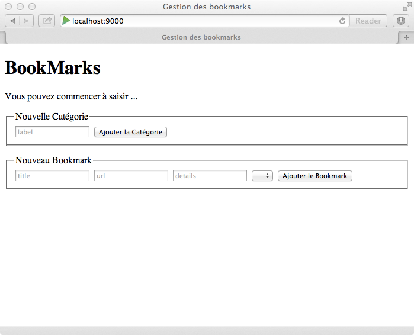

Jouez :

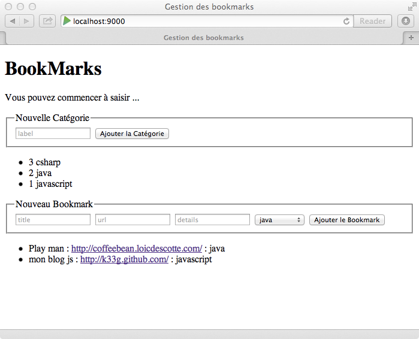

##Allez un peu de JS & des services maintenant !

Personnellement, je ne suis pas fan du templating scala, donc je vais régler ça en javascript, html & css ;)

###Obtenir la liste des catégories

Allons modifier le code du contrôleur `Categories.java` :

```java
	package controllers;

	import models.Category;
	import play.data.Form;
	import play.mvc.Controller;
	import play.mvc.Result;

	import java.util.HashMap;
	import java.util.List;
	import java.util.Map;

	import static play.libs.Json.toJson;


	public class Categories extends Controller {

	    public static Result add() {

	        final Form<Category> categoryForm = form(Category.class).bindFromRequest();
	        final Category category = categoryForm.get();

	        category.save();
	        return redirect(routes.Application.index());

	    }

	    public static Result jsonList() {

	        Map<String, List<Category>> data = new HashMap<String, List<Category>>();
	        List<Category> list = Category.find.orderBy("label").findList();
	        data.put("categories", list);
	        return ok(toJson(data));
	    }

	}
```

	TODO: expliquer

Ensuite, dans `routes`, ajouter ceci :

	GET /categories/list controllers.Categories.jsonList()

Et allons tester ça dans notre navigateur : 

- connectez vous à [http://localhost:9000/](http://localhost:9000/)
- passez en mode console

... puis saisissez la requête ajax suivante (grâce à jQuery) :

```javascript
	$.ajax({type:"GET",url:"categories/list",dataType:"json",success:function(d){ console.log("resp : ",d);},error:function(e){console.log("err : ",e);}})
```

Cela peut prendre un peu de temps la 1ère fois à cause de la compilation. Mais si tout va bien vous devriez obtenir ceci :

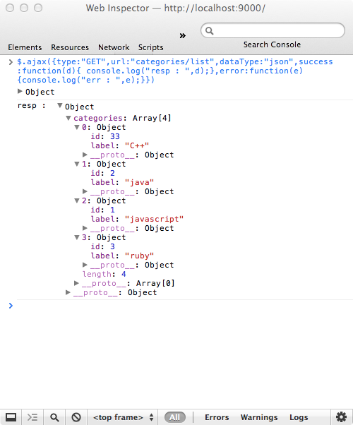

###Obtenir la liste des bookmarks

Nous allons utiliser le même principe pour les bookmarks :

Modifions le contrôleur `Bookmarks.java` :

```java
	package controllers;

	import models.Bookmark;
	import play.data.Form;
	import play.mvc.Controller;
	import play.mvc.Result;

	import java.util.HashMap;
	import java.util.List;
	import java.util.Map;

	import static play.libs.Json.toJson;

	public class Bookmarks extends Controller {

	    public static Result add() {

	        final Form<Bookmark> bookmarkForm = form(Bookmark.class).bindFromRequest();
	        final Bookmark bookmark = bookmarkForm.get();

	        bookmark.save();
	        return redirect(routes.Application.index());

	    }


	    public static Result jsonList() {

	        Map<String, List<Bookmark>> data = new HashMap<String, List<Bookmark>>();
	        List<Bookmark> list = Bookmark.find.orderBy("title").findList();
	        //List<Bookmark> list = Bookmark.find.fetch("category").orderBy("title").findList();
	        data.put("bookmarks", list);
	        return ok(toJson(data));
	    }
	}
```

Ensuite, dans `routes`, ajouter ceci :

	GET /bookmarks/list controllers.Categories.jsonList()

... puis re-passez en mode console et saisissez la requête ajax suivante :

```javascript
	$.ajax({type:"GET",url:"bookmarks/list",dataType:"json",success:function(d){ console.log("resp : ",d);},error:function(e){console.log("err : ",e);}})
```
Et l'on obtient ceci :

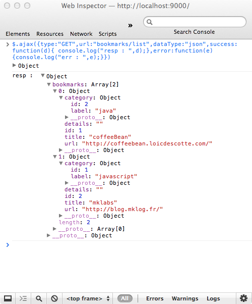

Vous pouvez remarquer que l'on a récupéré aussi les catégories associées aux bookmarks.

**Remarque** : cette fois-ci nous n'avons pas été obligé d'utiliser `List<Bookmark> list = Bookmark.find.fetch("category").orderBy("title").findList();`. **A creuser je pense.**

Allons un peu plus loin, après les requête de type `GET`, passons aux requêtes de type `POST`.

###Ajouter une catégorie

Allons modifier à nouveau le code du contrôleur `Categories.java` en lui ajoutant cette méthode :

```java
	@BodyParser.Of(BodyParser.Json.class)
    public static Result jsonAdd() {

        Http.RequestBody body = request().body();
        System.out.println(body.asJson());
        ObjectMapper mapper = new ObjectMapper();

        Category value = null;

        try {
            value = mapper.readValue(body.asJson().toString(), Category.class);
            Category found = Category.findByLabel(value.label);
            if(found!=null){
                System.out.println(value.label + " already exists");
                value.id = found.id;

            } else {
                value.save();
                System.out.println(value.id.toString()+" "+value.label + " has been saved");
            }

        } catch (IOException e) {
            e.printStackTrace();
        }

        return ok(toJson(value));
    }
```

	//TODO : expliquer

Au final le code avec les bons `imports` sera le suivant :

```java
	package controllers;

	import models.Category;
	import org.codehaus.jackson.map.ObjectMapper;
	import play.data.Form;
	import play.mvc.BodyParser;
	import play.mvc.Controller;
	import play.mvc.Http;
	import play.mvc.Result;

	import java.io.IOException;
	import java.util.HashMap;
	import java.util.List;
	import java.util.Map;

	import static play.libs.Json.toJson;


	public class Categories extends Controller {

	    public static Result add() {
	        final Form<Category> categoryForm = form(Category.class).bindFromRequest();
	        final Category category = categoryForm.get();

	        category.save();
	        return redirect(routes.Application.index());
	    }

	    public static Result jsonList() {

	        Map<String, List<Category>> data = new HashMap<String, List<Category>>();
	        List<Category> list = Category.find.orderBy("label").findList();
	        data.put("categories", list);
	        return ok(toJson(data));
	    }

	    @BodyParser.Of(BodyParser.Json.class)
	    public static Result jsonAdd() {

	        Http.RequestBody body = request().body();
	        System.out.println(body.asJson());
	        ObjectMapper mapper = new ObjectMapper();

	        Category value = null;

	        try {
	            value = mapper.readValue(body.asJson().toString(), Category.class);
	            Category found = Category.findByLabel(value.label);
	            if(found!=null){
	                System.out.println(value.label + " already exists");
	                value.id = found.id;

	            } else {
	                value.save();
	                System.out.println(value.id.toString()+" "+value.label + " has been saved");
	            }

	        } catch (IOException e) {
	            e.printStackTrace();
	        }

	        return ok(toJson(value));
	    }

	}
```

Ensuite, ajoutons dans `routes` :

	POST /test controllers.Categories.jsonAdd()

Et retournons jouer dans la console de notre navigateur :

```javascript
	$.ajax({type:"POST",url:"test",data:JSON.stringify({ label:"dart"}),dataType:"json",contentType:"application/json",success:function(d){ console.log("resp : ",d);},error:function(e){console.log("err : ",e);}})
```javascript

Côté Terminal, vous devriez voir s'afficher un message de ce type :

	{"label":"dart"}
	41 dart has been saved

Côté console du navigateur, vous aurez ceci :

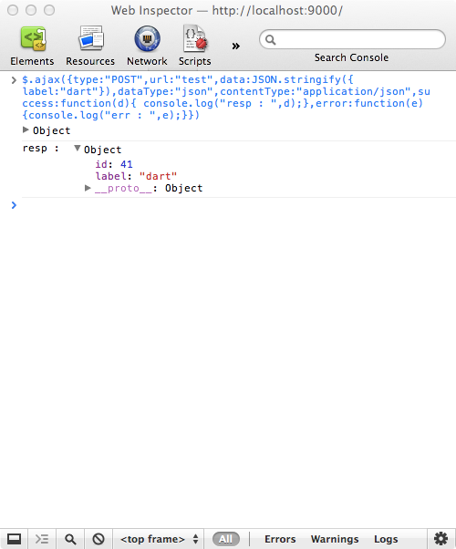

On peut donc voir que Play!> a bien affecté un id à la nouvelle catégorie.

puis relancez la requête ajax une deuxième fois :

Côté Terminal, vous aurez le message suivant :

	{"label":"dart"}
	dart already exists

Et côté console du navigateur, vous obtiendrez la même chose que lors de l'ajout.

##C'est tout pour cette partie

Vous avez maintenant de quoi commencer à jouer avec Play!> 2. Nous avons aujourd'hui tous les éléments nécessaires pour faire évoluer notre application. La prochaine partie utilisera ce que nous avons fait pour transformer notre application en "webapp" (une seule page côté client) avec le framework Backbone.js.

à bientôt pour la suite.


