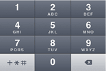

#Validation

	/* --- Qu'allons nous voir ? ---

		- comment définir des contraintes sur un modèle
		- comment vérifier les données d'un formulaire
		- comment valider les données côté client
	*/

##Enrichissement du modèle et vérification des données

Nous voulons nous assurer que l'utilisateur entre bien un label lors de la création d'un bookmark. Nous voulons aussi limiter la taille à 30 caractères (pourquoi pas?).
Pour cela nous allons utiliser les annotations @Required et @MaxLength

```java

  package models;

  import play.db.ebean.Model;
  import javax.persistence.*;
  import play.data.validation.Constraints;
 
  @Entity
  public class Category extends Model{

  @Id
  public Long id;

  @Constraints.Required
  @Constraints.MaxLength(30)
  public String label;

  // ...
  }


```

Ceci nous permettra ensuite de vérifier l'intégrité des données lors de la soumission du formulaire :

```java
  public static Result add() {
    final Form<Bookmark> bookmarkForm = form(Bookmark.class).bindFromRequest();
    if (bookmarkForm.hasErrors()) {
	  flash("error", "Form contains errors");
	  return badRequest(routes.Application.index());
    }
    final Bookmark bookmark = bookmarkForm.get();
    bookmark.save();
    return redirect(routes.Application.index());
  }
```
En cas de problème on renvoie une erreur à notre template.

Pour afficher cette erreur on peut ajouter ceci à notre fichier index.scala.html : 

```scala
  @if(flash.containsKey("error")) {
      <div class="alert-message warning">
          <strong>Oups!</strong> @flash.get("error")
      </div>
  } 
```

Il existe d'autres annotations de validation : 

 * @Max et @Min pour les valeurs numériques
 * @MinLength pour demander une taille longueur minimum à un champ
 * @Pattern qui permet de valider des expressions régulières
 * @Email pour valider le format email

On peut bien sûr écrire facilement nos propres validateurs...

##Validation côté client

Avec HTML5, il est possible de valider des données d'un formulaire directement depuis le navigateur avant de les envoyer au serveur.

Il existe [un module Play](https://github.com/loicdescotte/Play2-HTML5Tags) pour générer les bonnes balises HTML à partir des contraintes du modèle.

Dans le cas de notre application de gestion de bookmarks, on va pouvoir remplacer ceci : 

```html
  <input name="url" placeholder="url">
```

Par cela :

```scala
 @text(bookmarkForm("url"), 'placeholder -> "URL : ")

```

Et le "markup" approprié sera généré :

```html
<input name="url" placeholder="url" maxlength="30" required>
```
Le navigateur vérifiera alors la présence et la longueur du champ avant d'envoyer les données au serveur, ce qui permettra à l'utilisateur d'avoir un retour d'erreur plus rapide en case de problème et d'économiser un peu de bande passante!

Remarque : Le fait de référencer un objet `bookmarkForm` nous permettra si on le souhaite plus tard d'éditer un bookmark existant en remplissant directement le champ du formulaire avec la valeur de notre objet. On pourrait par exemple écrire quelque chose comme ça dans le contrôleur :

```java
  public static Result edit(Long id) {
    Form<Bookmark> bookmarkForm = form(Bookmark.class).fill(
      Bookmark.find.byId(id)
    );
    return ok(
      edit.render(id, bookmarkForm)
    );
  }
```


Le tag `text` tag est capable de changer le type d'"input" si une annotation particulière est détectée. 
Par exemple avec le modèle suivant :

```java
    @Constraints.Email
    public String contactMail;
```
    
Et ce tag :

```scala  
    @text(form("contactMail"))
```

On obtiendra ceci :

```html
    <input type="email" id="contactMail" name="contactMail" value="">
```
Et le navigateur vérifiera le format saisi :


HTML5 reconnait de nouveaux type de données dans les formulaires, comme les nombres, les dates, les numéros de téléphone, les URL....
Le module prend en charge ces types de données à travers des tags particuliers (@number, @date, @telephone, @url....)

Le fait de préciser le type d'"input" permet également au navigateur, particulièrement sur mobile, d'adapter son IHM au format demandé :
 


