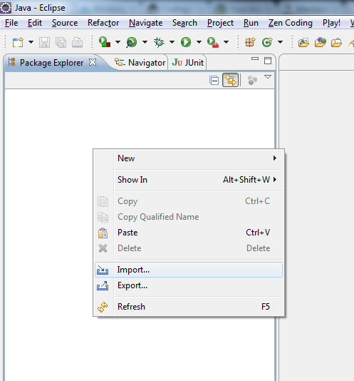
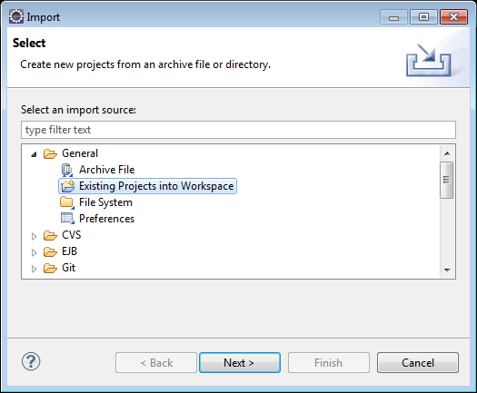
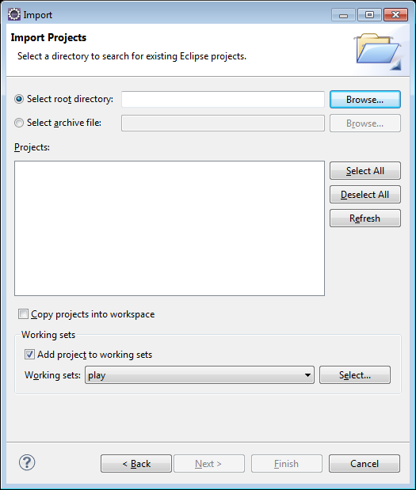
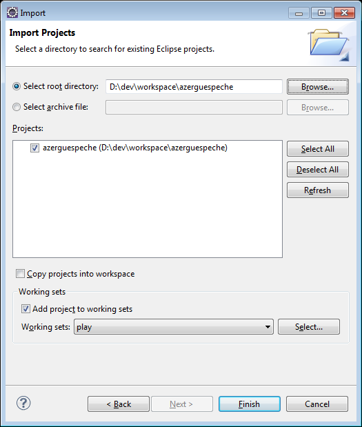
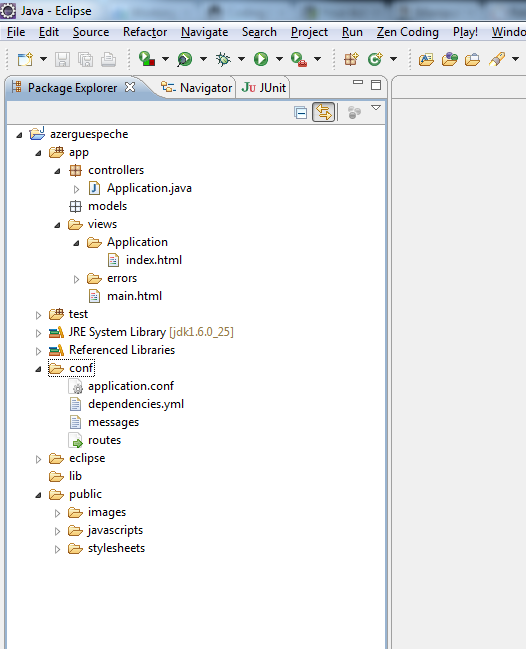

##Paramétrage d'Eclipse

- Tout d'abord, nous devons arrêter notre application : faire `Control+c` dans la console pour quitter
- En mode commande, placez vous dans votre répertoire "workspace" d'Eclipse
 
            cd C:\dev\workspace

- En mode commande : `play eclipsify azerguespeche` (ou bien le raccourci `play ec azerguespeche`)

            ~        _            _
            ~  _ __ | | __ _ _  _| |
            ~ | '_ \| |/ _' | || |_|
            ~ |  __/|_|\____|\__ (_)
            ~ |_|            |__/
            ~
            ~ play! 1.2.3, http://www.playframework.org
            ~
            ~ OK, the application is ready for eclipse
            ~ Use File/Import/General/Existing project to import C:\dev\workspace\azerguespeche into eclipse
            ~
            ~ Use eclipsify again when you want to update eclipse configuration files.
            ~ However, it's often better to delete and re-import the project into your workspace since eclipse keeps dirty caches...
            ~

**Puis on lance Eclipse et on fait les manipulations suivantes :**

- Importer notre nouveau projet :

- Choisir "Existing projects into workspace"

- Cliquer sur le bouton `Browse...`

- Après avoir choisi votre répertoire de workspace, cocher la ligne de votre projet `azerguespeche`. Une fois terminé, cliquer sur le bouton `Finish`

- Et hop! Vous arrivez dans l'arborescence de votre projet :

Pour lancer (ou debugger) l'application ou les tests depuis Eclipse, on fait un clic droit sur les fichiers `.run` dans le répertoire `eclipse` du projet, puis on sélectionne l'action `run as` (ou debug as) dans le menu contextuel.

**Voilà, nous sommes prêts à démarrer, nous pouvons passer à l'étape suivante.**
