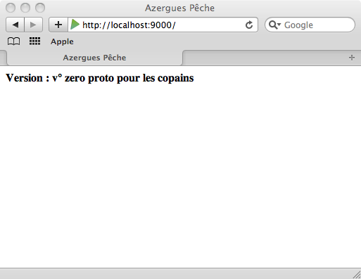

#Faut bosser maintenant !!!

Dans ce chapitre nous allons :

- créer notre 1ère page selon les préceptes MVC (kézaco ?)
- construire les bases de notre application

ces bases seront suffisantes pour avoir quelque chose qui tourne à montrer à nos copains les pêcheurs.

##Introduction 

*Remarque : si ça vous ennuie, il est tout à fait possible de passer au § suivant*

Alors, avant de remettre les mains dans le code, nous allons parler théorie. Et plus particulièrement "design pattern" (*definition ici : [http://fr.wikipedia.org/wiki/Design_pattern](http://fr.wikipedia.org/wiki/Design_pattern) (1)*) et encore plus particulièrement : **pattern MVC**, sûrement le pattern que j'ai le plus détesté, que j'ai trouvé être le pattern le plus crétin et le plus improductif de l'histoire des patterns.

Je m'explique, j'étais architecte .Net (v° 1.1), fan invétéré du modèle évènementiel d'ASP.Net (2) et en changeant de boîte (celle dont je parlais dans le chapitre précédent), j'ai hérité du pilotage d'une TMA Java avec des applications Web. Mon nouveau boss m'a dit : *"Tu n'es pas là pour coder, tu es là pour faire du management et de la relation client, donc pas besoin de connaître Java"*, **Moi (dans ma tête) :** *"wahouuu, trop sympa, ... mais en même temps, l'équipe va me prendre pour un c..."*.

Ca n'a pas loupé, dès le 1er jour :

- à ma demande *"Combien de temps pour modifier la mire de login là, pour changer la police et donner le focus sur la zone de saisie du user ?"*, 
- **mon ingé préféré :** *"tu sais java, c'est une techno très aboutie, mais qui n'est pas simple, mais si il n'y a pas de problème, d'ici la fin de la semaine cela devraît être bon ... tu sais STRUTS c'est pas pour les gamins"* `(ndla : on est lundi)` 
- **Moi (dans ma tête) :** *"comme un doute ... C'est sympa de passer pour c... auprès du client dès le premier jour ..."*

Je vous épargne la suite. Les anciens (la meilleure équipe que j'ai pu avoir (3)) de ce projet reconnaitront sûrement la personne à laquelle je fais allusion.

... bon j'en étais où ?

Ah oui, c'est alors que je décide de me mettre sérieusement à Java, et surtout de prendre les choses à l'envers et de brillamment m'auto-former à **STRUTS** (achat de bouqins, etc. ...) d'urgenge, car 5 jours pour une f@&%ing login box, ça me fait mal.

###Petit rappel : MVC

**STRUTS** c'est (c'était?) le framework web Java par excellence qui met en oeuvre le pattern **MVC** : **Modèle Vue Contrôleur** (Model View Controller). Il permet de séparer les responsabilités en 3 couches (m... j'en avais 5 moi ...) :

- *la vue* : c'est l'IHM, elle va recevoir des infos du **contrôleur** (*"tiens affiche moi ça"*), elle va envoyer des infos au contrôleur (*"au fait, on m'a clickée dessus, le gars il voudrait la liste des clients"*)
- *le contrôleur* : c'est lui donc qui reçoit des infos de la **vue**, qui va aller récupérer des données métiers chez le **modèle** (*"j'ai besoin pour la vue de la liste des clients"*), et va les renvoyer à la vue et éventuellement appliquer des traitements à ces données avant de les renvoyer.
- *le modèle* : c'est vos objets clients, fournisseurs, users, ... avec toute la mécanique qui sert à les sauvegarder, retrouver, modifier, supprimer ...

###Suite de l'introduction (où j'ai donc décidé d'apprendre STRUTS)

Et là c'est le drame ! Après avoir passé le cap de l'installation de mon serveur d'application (ça a bien changé maintenant, mais quand en plus on est habitué à IIS ...), après avoir installé et paramétré tous les bons plugins Eclipse, ce fut le 1er contact avec **STRUTS**.

Alors je ne suis pas complètement idiot, j'ai codé mes 1ers écrans et ma mire de login (en passant il ne faut pas 5 jours), mais alors qu'est ce que j'ai trouvé ça fastidieux et inutile ! Je ne sais combien de fichier pour un seul écran! **STRUTS** pas pour moi! (et là je suis tombé amoureux des **JSF**, si !).

Et bien vous allez voir (pour ceux qui ne connaissent pas) que :

##Avec Play!►, MVC c'est limpide !

Dans le chapitre précédent, nous avons initialisé notre application **AzerguesPeche**, il est temps maintenant de coder notre première page en mode MVC, comme ça après on n'en parle plus de MVC. Ami lecteur-codeur-newbee, prépare toi à entrer dans le monde de **Java + WEB** sans mal ni effort avec Play Framework (si c'est pas un slogan de bouqin ça!).

- Tout d'abord relancez votre application si elle ne tourne plus (`play run azerguespeche`)
- Ouvrez votre projet dans votre ide préféré (cf. chapitre précédent : [01-Preparation.fr.md](01-Preparation.fr.md))
- Observons la structure de notre future "killer-app"

###Structure d'azerguespeche et 1ère page

Dans IntelliJ vous pouvez voir dans l'arborescence de votre projet que vous avez plusieurs répertoires :

	- azerguespeche
		- app
			- controllers
			- models
			- views
				- Application

####1er modèle

créeons un premier modèle `version` dans le répertoire `models` :

~~~ java

	package models;

	public class Version {

	    public String reference;
	    public String name;

	    public Version() {
	        this.reference="v° zero";
	        this.name="proto pour les copains";
	    }
	}
~~~

**Remarque :** vous pouvez voir qu'il n'y a pas de getter ni de setter, juste des "champs" publiques. Dans la majeure partie des cas vous n'en n'avez pas besoin, alors à quoi bon ? Sachez cependant que Play!► va les générer lui même à la compilation (vous ne verrez rien dans le code). Au besoin vous pouvez les écrire vous même si nécessaire.

####Et le contrôleur ?

Cette fois-ci nous allons modifier le contrôleur `Application` dans le répertoire `controllers` :

*Si vous n'avez touché à rien vous devez avoir le code suivant :*

~~~ java

	package controllers;
	import play.*;
	import play.mvc.*;
	import java.util.*;
	import models.*;

	public class Application extends Controller {

	    public static void index() {
	        render();
	    }
	}
~~~

*Modifions la méthode `index()` :*

~~~ java
	public class Application extends Controller {

	    public static void index() {

	        Version version = new Version();

	        render(version);
	    }
	}
~~~

####Allons modifier la vue Application

- Ouvrez la page `index.html` du répertoire `views/Application/`
- Vous devez avoir le code suivant :

	
		#{extends 'main.html' /}
		#{set title:'Home' /}

		#{welcome /}

- Que vous allez remplacer par :

	
		#{extends 'main.html' /}
		#{set title:'Azergues Pêche' /}

		<B>Version : ${version.reference} ${version.name}</B>

**Remarque :** `#{extends 'main.html' /}` signifie que `index.html` hérite de `main.html` (si vous allez regarder dans `main.html`, vous verrez que c'est là que sont déclarées les ressources css, js, etc. ...)

**Remarque bis :** *Que vient-on de faire ?*, eh bien, lorsque nous allons nous connecter, le contrôleur `Application` va instancier le modèle `Version` qui sera affiché dans la vue `Application`(`index.html`) grâce à la méthode `render(version)` utilisée dans le contrôleur.

Si c'est vrai ! Vous n'avez qu'à appeler l'url [http://localhost:9000/](http://localhost:9000/) dans votre navigateur :

*Et là je sens que une pointe de fierté et de satisfaction monter en vous ... non ???*

Donc, comme vous venez de le voir, faire discuter un contrôleur avec un modèle et une vue, ça n'a rien de bien compliqué, surtout avec Play!►. Là sans vous en aperçevoir, vous avez compris MVC.

**Question :** 

- *Euh ... et Play!►, comment il sait qu'il faut ouvrir la page index.html ?*
- *c'est une excellente question !*

Allez ouvrir le fichier `routes` dans répertoire `conf` de votre projet, il contient le code suivant :

	# Routes
	# This file defines all application routes (Higher priority routes first)
	# ~~~~

	# Home page
	GET /   Application.index

	# Map static resources from the /app/public folder to the /public path
	GET /public/    staticDir:public

	# Catch all
	*       /{controller}/{action}                  {controller}.{action}

En fait la ligne :

	# Home page
	GET /   Application.index

explique que quand on appelle la racine du site dans l'url (le "`/`" tout seul), alors on ouvre la page index.html du répertoire Application (c'est une **convention**)

##Vous êtes prêts ! ... pour aller plus loin : des objets, des écrans ...

Où nous allons créer les bases d'***Azergues Pêche*** grâce au module CRUD de Play

###Préparation

c'est dans le chapitre suivant : [ch03-Premiere-application-CRUD](ch03-Premiere-application-CRUD.md).

- - -
	
- (1) : oui, je sais, ce n'est pas la meilleure source d'information qui soit, ni la plus fiable, mais bon ... n'hésitez pas à poster vos définitions dans les "issues" du projet : [https://github.com/3monkeys/play.rules/issues](https://github.com/3monkeys/play.rules/issues).
- (2) : je le suis encore un peu, je dois l'avouer, mais on ne se refait pas.
- (3) : sans aucune ironie

